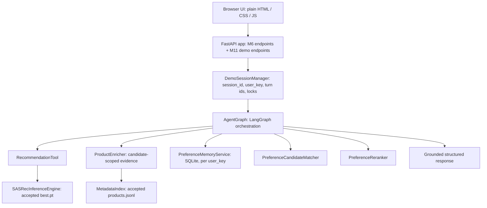
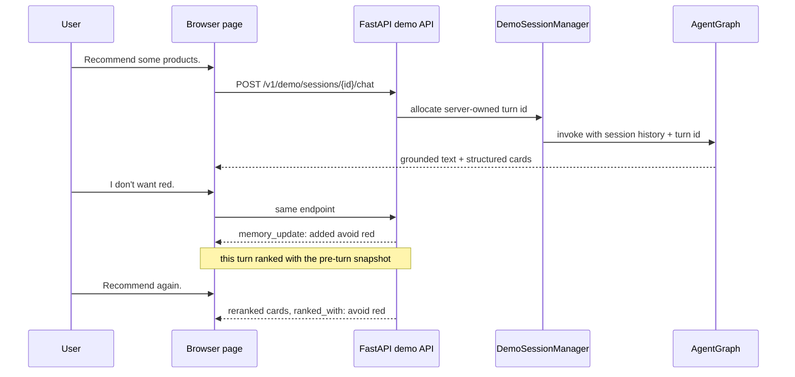
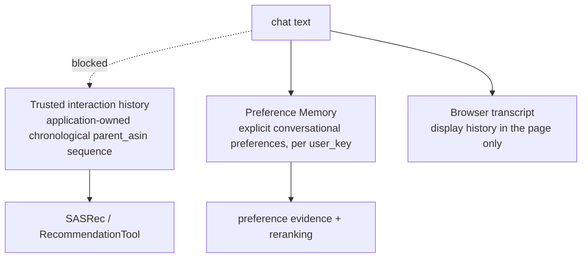

# AgentRec-X

AgentRec-X is a **sequential-recommendation + conversational-agent research system** built
incrementally over 19 verified milestones. It trains a SASRec recommender on the full
Amazon Reviews 2023 *Sports & Outdoors* category, exposes it to an agent through a narrow
tool contract, grounds it in product metadata, adds explicit conversational preference
memory, matches those preferences against candidate metadata, reranks candidates under a
frozen deterministic policy, and serves the whole pipeline through a multi-turn browser
demo — without letting conversational state contaminate behavioural history.

Every number below is taken from a committed artifact or a smoke run; where something is
not measured, this README says so.

---

## What AgentRec-X Is

It answers one question end to end: *can a sequential recommender be handed to a
conversational agent without giving the agent the ability to corrupt what the recommender
knows, while still letting the conversation influence what the user sees?*

| Layer | Component |
| --- | --- |
| Candidate generation | **SASRec** (item-ID transformer), trained on full-category data |
| Product grounding | **M8 metadata / candidate-scoped RAG** (lexical BM25 inside the candidate set) |
| Persistent constraints | **M9 Preference Memory** (explicit preferences, ADD / REPLACE / REMOVE) |
| Preference reasoning | **M10A Preference Evidence** (`MATCH` / `VIOLATION` / `UNKNOWN`) |
| Ordering | **M10B deterministic reranking** (frozen lexicographic policy) |
| Orchestration | **AgentGraph** (LangGraph, injected decision seam) |
| Serving | **FastAPI** (M6 + M11 endpoints) with a plain HTML/CSS/JS browser demo |

It is **not** a fully LLM-powered recommender. The candidate pool is produced by SASRec,
not by retrieval or generation, and the formal decision seam is deterministic and offline.
See [What Is Learned vs Rule-Based](#what-is-learned-vs-rule-based).

---

## System Architecture



Component responsibilities, state ownership, failure behaviour and reuse rules:
[`docs/ARCHITECTURE.md`](docs/ARCHITECTURE.md).

---

## End-to-End Request Flow

The recommendation route inside `AgentGraph`:

```mermaid
flowchart LR
    A["trusted interaction history<br/>application-owned"] --> B["RecommendationTool"]
    B --> C["SASRec candidates<br/>original rank + raw score"]
    C --> D["metadata enrichment M8"]
    D --> E["candidate-scoped evidence<br/>retrieval within candidates"]
    E --> F["active preference snapshot<br/>loaded at turn start M9"]
    F --> G["preference evidence<br/>MATCH / VIOLATION / UNKNOWN M10A"]
    G --> H["deterministic reranking<br/>M10B frozen policy"]
    H --> I["grounded structured response<br/>original rank + reranked rank"]
```



The `DIRECT` route performs **zero** recommendation, metadata, matching or reranking work;
it may still read and persist preference memory.

---

## What Is Learned vs Rule-Based

This distinction is central to reading the project correctly.

| Component | Type |
| --- | --- |
| SASRec candidate generation | **learned neural recommender** (the only trained model) |
| Product metadata lookup | deterministic (exact `parent_asin` probe) |
| Candidate-scoped RAG | deterministic lexical retrieval (BM25 within candidates) |
| Preference memory lifecycle | deterministic structured state |
| Preference extraction | conservative rule-based, behind an injected seam |
| Preference matching | deterministic (three-state evidence) |
| Preference reranking | deterministic lexicographic policy |
| Agent decision seam | injected; formal tests and demo run a deterministic offline rule |
| Web / session layer | application plumbing, no recommendation logic |

There is no LLM in the serving path, no hosted-provider call and no API key. A
provider-backed decision model could be added later behind the existing injected seam
without touching any other component.

---

## Dataset & Evaluation Protocol

| Property | Value | Source |
| --- | --- | --- |
| Dataset | Amazon Reviews 2023, *Sports & Outdoors* | `run.json`, catalog manifest |
| Canonical identity | `parent_asin` (opaque; **not** assumed to start with `B`) | preprocessing contract |
| Evaluation users | 412,445 | `run.json` → `cohort.num_users_eligible` |
| Catalogue items | 156,746 | `run.json` → `cohort.catalog_size` |
| Train interactions | 2,675,697 | `run.json` → `train_history_statistics.total_interactions` |
| Next-item transitions | 2,263,252 | `run.json` → `train_transitions` |
| Users excluded | 0 | `run.json` → `cohort.num_users_excluded` |
| `max_seq_len` | 50 | `run.json` → `max_seq_len` |
| Protocol | `temporal_leave_two_out` (`agentrecx.eval_protocol.v1`) | `run.json` → `cohort.protocol` |

For a chronological sequence `[i1, ..., i(n-2), i(n-1), in]` with `n >= 3`:

```text
train history    = [i1, ..., i(n-2)]
validation       : history = train history              target = i(n-1)
test             : history = train history + [i(n-1)]   target = in
```

* eligibility requires **sequence length >= 3**; ineligible users are excluded at the
  evaluation layer, never by adjusting preprocessing thresholds;
* **full-catalogue ranking** — no sampled negatives in the canonical benchmark;
* **PAD (item id 0) is never a candidate**; **already-seen items are masked**; the **target
  stays eligible even when it repeats** in the history;
* **deterministic tie rule**: higher score first, then **lower item id** — a total order
  independent of sort stability;
* metrics are **HR / Recall / NDCG at 5, 10, 20**; with one positive per case
  **HR@K == Recall@K** by construction (asserted in the manifest's `checks`);
* the **checkpoint is selected on validation only**, and the **test set stays sealed** until
  the final evaluation (`test_sealed.test_used_for_selection = false`).

The early **100k-record prefix** used during engineering integration is **not** a
benchmark: its sparsity says nothing about the difficulty of the final benchmark, and none
of its numbers are reported here as results.

---

## SASRec Benchmark

From `runs/sasrec_canonical_2026/run.json` (`run_id = m5b-sasrec-canonical-seed2026`,
seed 2026), exact as stored.

| Metric | Validation @5 | @10 | @20 | Test @5 | @10 | @20 |
| --- | --- | --- | --- | --- | --- | --- |
| HR | 0.009235 | 0.015311 | 0.023855 | 0.008304 | 0.013565 | 0.021489 |
| Recall | 0.009235 | 0.015311 | 0.023855 | 0.008304 | 0.013565 | 0.021489 |
| NDCG | 0.005957 | 0.007913 | 0.010062 | 0.005333 | 0.007020 | 0.009009 |

HR and Recall coincide because the protocol has a single positive target per case.

* **Best epoch 6**, selected on validation NDCG@10 (`0.007913`); **17 epochs completed**
  (`MAX_EPOCHS = 200`, `PATIENCE = 10`, *patience exhausted*); 27,404 global steps; train
  time 1,627.66 s; peak GPU memory 4,997,753,344 bytes.
* **Model:** SASRec, `hidden 64`, `blocks 2`, `heads 2`, `dropout 0.2`, `gelu`, pre-norm,
  FF×4, `init_range 0.02`, `ln_eps 1e-8`, `max_seq_len 50`, `padding_idx 0`.
  **Optimizer:** AdamW, `lr 0.001`, `batch 256`, `weight_decay 0.0`, `grad_norm 5.0`,
  `seed 2026`, fp32.
* `max_seq_len = 50` was the smallest window retaining ≥95 % of raw transitions (0.98234 at
  50; 0.92314 at 20; 0.995259 at 100; 0.998949 at 200).

**No ItemCF comparison exists.** `run.json` records
`itemcf_comparison = "PENDING (no same-artifact full-data ItemCF benchmark exists)"`. The
ItemCF code in `recommendation/baselines/` is an engineering baseline over the small
integration sample and must not be compared against the numbers above.

---

## Preference-Aware Agent Pipeline

**Preference Memory (M9)** stores *explicit* shopping constraints only — never inferred
from behaviour, demographics, candidates or model output. Lifecycle:

| Operation | Example | Result |
| --- | --- | --- |
| **ADD** | "I don't want red." then "I don't want blue." | both avoidances stay active |
| **REPLACE** | "I prefer black." then "Actually, I prefer blue instead." | `black` `superseded`, `blue` active |
| **REMOVE** | "I don't care about color anymore." | matching constraints `removed`; provenance kept |

Superseded and removed entries are retained for audit and never used in ranking.

**Preference Evidence (M10A)** is three-state, deliberately not a boolean: `MATCH`
(positively satisfied), `VIOLATION` (forbidden value present or numeric bound broken), and
`UNKNOWN` (the metadata cannot decide). `UNKNOWN` is **neutral** — never rewarded, never
penalised. A positive preference whose listed value differs (`prefer red`, metadata says
`blue`) is `UNKNOWN`, not a violation, because a metadata record is not an exhaustive
product specification. Positive preferences never produce a violation.

**Deterministic reranking (M10B)** applies one frozen key:

```text
(violation_count ASC, match_count DESC, original_rank ASC, item_id ASC)
```

fewer supported violations wins; at equal violations more supported matches wins;
remaining ties preserve the original SASRec order; `item_id` is a defensive final key.
M10C proved that with valid input (**unique original ranks**) `item_id` is never reached,
so it does not determine production ordering. Reranking never adds, drops, replaces or
filters a candidate and never modifies the raw SASRec score.

---

## Multi-turn Web Demo



The demo runs in the same FastAPI process as the Milestone 6 API. Each session gets an
opaque UUID4 `session_id`, a **session-derived** preference-memory `user_key`, a demo
profile's application-owned trusted history, and its own turn lock. Two sessions on the same
profile never share preference memory.

Preference timing is preserved exactly from M9: a preference stated in the current message
is persisted during that turn but **takes effect from the next turn** — `audit.
ranked_with_preferences` shows what actually ranked the turn. The UI renders the API's
candidate order verbatim and never re-sorts, re-scores or filters.
Walkthrough: [`docs/USAGE.md`](docs/USAGE.md).

---

## Quick Start

Uses the **already accepted artifacts**; nothing is retrained and no accepted artifact is
written. Setup and start are deliberately separate: a normal start never installs anything.

**Windows 11 + WSL2 (one click).** Open the repository folder in Explorer, for example
`\\wsl.localhost\Ubuntu-22.04\home\<you>\AgentRec-X`, and double-click
`start-agentrecx.cmd`. It opens a console, invokes WSL automatically, runs the same Linux
launcher below, and (after `/health` answers) opens the default browser at the demo page.
The console stays in the foreground for the server log, and one `Ctrl+C` stops the demo.

No configuration is needed. The `.cmd` is only a shim: it derives the Linux path from its
own location (never the current directory — a UNC working directory is illegal in
`cmd.exe`) and hands over to `scripts/windows/start_agentrecx.ps1`, which asks WSL which
distributions actually exist (`wsl.exe --list --quiet`) and verifies
`<repo>/scripts/start_demo.sh` inside the selected one before anything is launched. A
distribution name is never guessed, and no username is hardcoded. Use
`--self-test` to resolve and verify without starting anything, and `AGENTRECX_PORT`,
`AGENTRECX_DISTRO` or `AGENTRECX_REPO` to override; `start-agentrecx.local.cmd.example`
shows how to run it from outside the repository.

**Linux / WSL shell.**

```bash
./scripts/setup_demo.sh     # once: create .venv, install CPU-only deps, verify artifacts
./scripts/start_demo.sh     # every time: read-only preflight, then foreground Uvicorn

# then open:  http://127.0.0.1:8000/demo/   and   http://127.0.0.1:8000/docs
```

`setup_demo.sh` installs PyTorch from the official CPU wheel index
(`requirements-cpu.txt`) rather than running a plain `pip install torch`, which would pull
CUDA/NVIDIA packages onto a machine with no GPU. `start_demo.sh` works from any directory,
never installs anything, and never stops a process it did not start: if the port is already
serving AgentRec-X it says so and exits, and if a foreign process holds the port it refuses
to start rather than killing it. Stop the demo with `Ctrl+C`.

The server refuses to start if an accepted artifact is missing, rather than failing on the
first browser request. Host and port default to `127.0.0.1:8000`
(`./scripts/start_demo.sh --port 8011` to change it, `--doctor` to check the environment and
the five accepted artifacts).

Optional sanity checks: `.venv/bin/python -m experiments.web_demo_smoke` (accepted M11
behaviour over HTTP) and `.venv/bin/python -m experiments.local_demo_launch_smoke` (the
launcher over a real Uvicorn socket and process).

---

## API Usage

Preserved Milestone 6 endpoints:

| Method | Path | Purpose |
| --- | --- | --- |
| `GET` | `/health` | process/model readiness |
| `GET` | `/v1/model` | non-sensitive model metadata |
| `POST` | `/v1/recommend` | top-k recommendations for a `parent_asin` history |

Milestone 11 demo endpoints:

| Method | Path | Purpose |
| --- | --- | --- |
| `GET` | `/v1/demo/health` | demo readiness |
| `GET` | `/v1/demo/profiles` | server-owned demo profiles |
| `POST` | `/v1/demo/sessions` | create an isolated session |
| `GET` | `/v1/demo/sessions/{session_id}` | session state + ACTIVE preferences |
| `POST` | `/v1/demo/sessions/{session_id}/chat` | one conversational turn |
| `DELETE` | `/v1/demo/sessions/{session_id}` | reset that session |

```bash
curl -s -X POST http://127.0.0.1:8000/v1/recommend \
  -H 'Content-Type: application/json' \
  -d '{"history": ["B0BX5QFWQN", "B0BBFB48YQ", "B00C6OUDX2"], "k": 3}'

curl -s -X POST http://127.0.0.1:8000/v1/demo/sessions \
  -H 'Content-Type: application/json' -d '{"profile_id": "demo-user-1"}'

curl -s -X POST http://127.0.0.1:8000/v1/demo/sessions/<SESSION_ID>/chat \
  -H 'Content-Type: application/json' \
  -d '{"message": "Recommend some products.", "k": 5}'
```

Schemas, error codes and the full recipe list: [`docs/USAGE.md`](docs/USAGE.md).

---

## Running Tests

```bash
.venv/bin/python -m pip check
.venv/bin/python -m pytest -q
.venv/bin/python -m compileall -q recommendation tests experiments
```

**Test counts are a snapshot of a commit, not a permanent property of the project.** At the
last milestone commit (`c7c3bf5`) the suite contained **1315 passed, 2 skipped** (1317
collected across 35 test files). This documentation pack adds **57 documentation-verification
tests** (`tests/test_docs.py`, which checks that documented links, HTTP paths, smoke module
names and code fences are real), bringing the working tree to **1372 passed, 2 skipped**.
Suites that need the accepted checkpoint or the 300 MB metadata artifact skip cleanly when
those git-ignored files are absent.

Smoke tests live in `experiments/` and print explicit PASS/FAIL gates:

```bash
.venv/bin/python -m experiments.web_demo_smoke             # M11, real HTTP, 39 gates
.venv/bin/python -m experiments.agent_reranking_smoke      # M10D, real chain
.venv/bin/python -m experiments.reranking_evaluation_smoke # M10C, policy diagnostics
```

Full smoke matrix: [`docs/USAGE.md`](docs/USAGE.md).

---

## Reproducing Core Experiments

**Demo reproduction (minutes).** Use the accepted artifacts: verify the checkpoint digest,
start the server, open the demo.

**Benchmark reproduction (hours, GPU).** Rebuild the processed artifacts from the raw
Amazon files, train SASRec, select the checkpoint on validation, then open the sealed test
set once. Commands, flags and expected outputs: [`docs/EXPERIMENTS.md`](docs/EXPERIMENTS.md).

Retraining produces **new** run directories; it does not modify
`runs/sasrec_canonical_2026/` in place, and the benchmark above stays tied to its recorded
commit and digests.

---

## Project Structure

```text
recommendation/        preprocessing, datasets, models, training, evaluation, baselines,
                       inference, tools, agent, catalog, rag, memory,
                       preference_matching, reranking, api, demo, web
experiments/           training/evaluation runs and PASS/FAIL smoke tests
tests/                 pytest suites (offline-first; real-artifact tests skip cleanly)
runs/  data/           accepted checkpoints, manifests and datasets (git-ignored)
docs/                  architecture, experiments, usage, project history
```

`recommendation/` is split by responsibility, one package per stage of the pipeline; each
package has its own README with its internal contract and boundary. Package overview:

| Package | Owns |
| --- | --- |
| `datasets/` `models/` `training/` | SASRec dataset, architecture, trainer, checkpoint I/O |
| `evaluation/` `baselines/` | frozen leave-two-out protocol, metrics, ItemCF engineering baseline |
| `inference/` `api/` | serving engine, deterministic top-k ranking, FastAPI endpoints |
| `tools/` `agent/` | RecommendationTool contract, AgentGraph orchestration |
| `catalog/` `rag/` | `parent_asin` metadata artifact and candidate-scoped retrieval |
| `memory/` `preference_matching/` `reranking/` | preference lifecycle, three-state evidence, frozen policy |
| `demo/` `web/` | demo profiles/sessions/runtime, browser assets |

---

## Design / Trust Boundaries

**Three different things are never conflated:**



* **Trusted interaction history** is application-owned and reaches the recommender only
  through `RecommendationContext`. **No conversational text can append to it**: telling the
  demo *"I bought B0BX5QFWQN yesterday."* creates no interaction event — asserted at the
  API level.
* **Preference Memory** holds explicit conversational preferences only, scoped per user key,
  with full provenance; it never stores inferred behaviour.
* **The browser transcript** is display state in the page, not persisted server-side.

**Candidate-scoped RAG cannot widen the candidate set**: SASRec chooses the candidate
universe first, and retrieval selects supporting metadata evidence only *inside* those
candidates. RAG cannot introduce a candidate, replace candidate generation, or reorder
candidates by itself — reordering is a later stage with its own frozen policy.

---

## Results & Diagnostics

Three categories of evidence are kept separate; they are **not** one "model performance"
table.

**A. Recommendation benchmark** — full-catalogue SASRec metrics, see
[SASRec Benchmark](#sasrec-benchmark).

**B. Policy diagnostics (M10C)** — offline, deterministic 20-request real cohort
(100 candidates) under a **globally fixed synthetic preference fixture** (*synthetic
explicit preference fixtures for policy diagnostics*; not observed real-user preferences):

| Diagnostic | Value |
| --- | --- |
| Requests with movement | 15 / 20 (0.75) |
| Candidates moved | 58 / 100 (promoted 31, demoted 27, unchanged 42) |
| Mean absolute displacement | 0.94 (max 4) |
| Top-k overlap (k = 1, 3, 5) | 8/20 = 0.40 · 49/60 = 0.816667 · 100/100 = 1.0 |
| Top-1 violations 2 → 0 · matches 27 → 41 · UNKNOWN 71 → 59 | adherence at k = 1 |
| All-UNKNOWN candidates | 7 / 100 (0.07) |
| `item_id` tie-break used | 0 (`duplicate_original_rank_count` = 0) |
| Policy-order violations / protection inversions | 0 / 0 |
| Deterministic report digest | `c8fe88efbdc96188…` |

This shows that reranking **increases adherence to the configured explicit-preference
policy** under the evaluated synthetic fixtures, without changing the candidate set or any
raw score. It does **not** show that recommendations got better: with no
preference-conditioned relevance labels, no NDCG / HR / Recall / CTR / conversion /
satisfaction claim is made for reranking anywhere in this repository.

**C. Engineering / system results:**

| Metric | Value |
| --- | --- |
| Test suite (milestone commit `c7c3bf5` / with this documentation pack) | 1315 / 1372 passed, 2 skipped |
| M10D M10A matcher / M10B reranker latency (p50) | ~0.46 ms / ~0.11 ms |
| M10D added reranking overhead (p50) | ~0.58 ms |
| M10D total graph latency (one request, CPU) | ~55 ms |
| M11 session creation (p50 / p95) | ~1.8 ms / ~2.0 ms |
| M11 chat, recommend route (p50 / p95) | ~48–55 ms / ~50–73 ms |
| M11 chat, direct route (p50 / p95) | ~7–9 ms / ~8–11 ms |

Latency figures are **engineering diagnostics from the accepted local CPU setup** (RTX
4090 host, CPU inference), shown as approximate values because repeated runs vary — the
M10A matcher p50 has been observed at both 0.463 ms and 0.465 ms, and the total graph
latency between 55.3 ms and 55.5 ms; M11 recommend-route p50 has been measured at 48.3 ms
and 54.6 ms across repeated runs. They are environment-specific and are not
hardware-independent performance claims.

---

## Limitations

Scope and design boundaries, not defects.

* **Preference extraction is conservative and rule-based** — it targets explicit shopping
  statements, behind an injected seam a model adapter could replace.
* **Preference evidence coverage can be sparse.** Reading a field that holds a *different*
  value is `UNKNOWN` by design, so coverage under-reports available metadata; 93/100
  candidates on the accepted cohort had at least one decisive observation.
* **No preference-conditioned relevance labels and no user study** — policy adherence is
  measured, quality improvement is not claimed.
* **No production authentication.** Session ids are opaque capability tokens, not an
  identity system. The **live session registry is process-local** and does not survive a
  restart; stored preference memory does persist.
* **Reset retains preference rows as unreachable audit provenance** — accepted memory
  semantics retain history, and the web layer is forbidden from erasing store rows.
* **No learned Critic**; reranking is lexicographic and frozen, not weighted or learned.
* **Candidate generation is item-ID SASRec** — no Semantic IDs and no generative recommender.
* **Candidate-scoped RAG is lexical BM25**, not dense retrieval.
* **The M10B tail reason label can be imprecise** for the last candidate. Ordering is
  correct (M10C verified the policy key) and the label is deliberately not surfaced to
  users; movement text is built from the two ranks instead.

---

## Roadmap

The next research track is a **Semantic ID / RQ-VAE backbone**: replacing item-ID SASRec
candidate generation with a semantic-ID representation and re-testing the pipeline. It is
**not implemented**.

A future backbone should reuse the existing contracts where they permit:
`RecommendationTool`, M8 metadata/RAG, M9 Preference Memory, M10A Preference Evidence,
M10B deterministic reranking, `AgentGraph` and the web demo. Only the candidate-generation
stage should need to change.

---

## Control Plane (2.0-alpha)

`recommendation/control/` adds an **opt-in** bounded agent loop beside the accepted DAG:
a policy proposes one action (`RECOMMEND_FROM_HISTORY` or `FINISH`), the controller
validates and stamps it, the accepted pipeline executes it, and control returns to the
policy with a verified observation. Recommend, render and memory semantics are reused
unchanged; the default stays the accepted DAG. Enable it with
`AGENTRECX_CONTROL_PLANE=loop`, and verify it with
`.venv/bin/python -m experiments.control_plane_smoke`. Topology, authority split and
budgets: [docs/ARCHITECTURE.md](docs/ARCHITECTURE.md).

## Documentation

| Document | Contents |
| --- | --- |
| [`docs/ARCHITECTURE.md`](docs/ARCHITECTURE.md) | goals, component map, state ownership, trust boundaries, failure behaviour, determinism, reuse |
| [`docs/EXPERIMENTS.md`](docs/EXPERIMENTS.md) | research questions, dataset, protocol, model, training, accepted results, diagnostics, reproducibility, validity threats |
| [`docs/USAGE.md`](docs/USAGE.md) | environment, artifacts, env vars, server, browser walkthrough, API recipes, tests, smokes, troubleshooting |
| [`docs/PROJECT_HISTORY.md`](docs/PROJECT_HISTORY.md) | milestone-by-milestone history with commit hashes |
| [`docs/README.md`](docs/README.md) | documentation index |
| [`AGENTS.md`](AGENTS.md) | development instructions and engineering rules |

Per-package contracts live next to the code, e.g.
[`recommendation/agent/README.md`](recommendation/agent/README.md),
[`recommendation/memory/README.md`](recommendation/memory/README.md),
[`recommendation/preference_matching/README.md`](recommendation/preference_matching/README.md),
[`recommendation/reranking/README.md`](recommendation/reranking/README.md),
[`recommendation/demo/README.md`](recommendation/demo/README.md).
