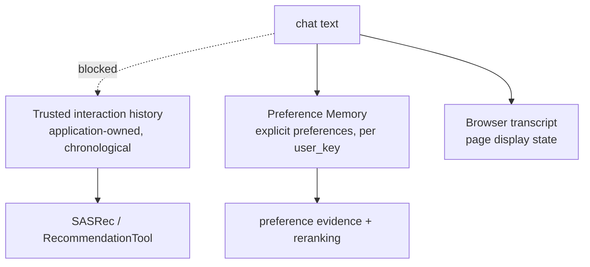

# AgentRec-X — Architecture

This document explains **what each part of the system owns and where its boundaries are**.
It is deliberately not API-reference documentation: per-package READMEs next to the code
hold the detailed contracts, and this file holds the shape.

Cross-references: [README](../README.md) · [Experiments](EXPERIMENTS.md) ·
[Usage](USAGE.md) · [Project history](PROJECT_HISTORY.md).

---

## 1. Architectural goals

1. **One trained model, everything else inspectable.** SASRec is the only learned component.
   Every other decision — retrieval, matching, ordering, routing — is deterministic and
   reviewable by reading the code.
2. **The conversational layer must not be able to corrupt behavioural data.** This is the
   primary safety property, and it is enforced structurally rather than by convention.
3. **Never fabricate.** Missing metadata stays missing; unavailable evidence stays
   `UNKNOWN`; a failed stage raises instead of degrading into plausible-looking output.
4. **No silent quality claims.** Offline policy diagnostics measure adherence to a
   configured policy, not relevance. The evaluation protocol, the benchmark and the
   diagnostics are reported as three separate categories of evidence.
5. **Compose, do not duplicate.** Each milestone added a stage behind an existing seam, and
   later stages reuse earlier contracts instead of re-implementing them.
6. **Reproducibility as a feature.** Deterministic seeds, recorded digests, frozen
   protocols, and deterministic payloads that exclude timing and machine metadata.

---

## 2. Component map

| Module | Owns | Does not own |
| --- | --- | --- |
| `recommendation/preprocess.py`, `io_utils.py` | raw review ingestion, k-core filtering, deterministic id mapping, processed artifacts | any modelling |
| `recommendation/datasets/` | SASRec training dataset, negative sampling, inference-time history encoding | scoring |
| `recommendation/models/` | SASRec architecture | training loops |
| `recommendation/training/` | deterministic trainer, checkpoint I/O, selection state | data splitting |
| `recommendation/evaluation/` | the frozen temporal leave-two-out protocol, masking, metrics | any ranking policy for serving |
| `recommendation/baselines/` | ItemCF engineering baseline | benchmark claims |
| `recommendation/inference/` | checkpoint loading, catalog scoring, deterministic top-k ranking | HTTP, agent concerns |
| `recommendation/tools/` | `RecommendationTool`: the agent-facing recommendation contract | model internals |
| `recommendation/catalog/` | `parent_asin`-keyed metadata: normalization, artifact, lookup | retrieval, ranking |
| `recommendation/rag/` | candidate-scoped evidence retrieval (`ProductEnricher`) | candidate generation |
| `recommendation/memory/` | explicit preference memory: schemas, stores, lifecycle (`PreferenceMemoryService`) | extraction from history, ranking |
| `recommendation/preference_matching/` | three-state preference↔metadata evidence (`PreferenceCandidateMatcher`) | ordering |
| `recommendation/reranking/` | the frozen ordering policy (`PreferenceReranker`) and its offline evaluation | evidence semantics |
| `recommendation/agent/` | `AgentGraph` orchestration, state, decision contract | any recommendation logic |
| `recommendation/api/` | FastAPI app, M6 endpoints, demo routes, error mapping | recommendation logic |
| `recommendation/demo/` | demo profiles, `DemoSessionManager`, `DemoRuntime`, public serialization | recommendation logic |
| `recommendation/web/` | browser assets (plain HTML/CSS/JS) | any client-side ranking |

---

## 3. Recommendation backbone

```text
raw Amazon Reviews 2023  ->  preprocessing (iterative k-core, deterministic ids)
                         ->  processed sequences + mappings artifacts
                         ->  SASRec dataset (temporal leave-two-out)
                         ->  SASRec training (validation-selected checkpoint)
                         ->  sealed test evaluation (once)
                         ->  accepted checkpoint + run manifest
```

Invariants that later layers depend on:

* interactions are **chronologically ordered**; there is no random splitting anywhere;
* item id **0 is PAD** and is never a real item; real ids start at 1;
* `parent_asin` is the **canonical** product identity and is treated as an **opaque
  string** (nothing assumes a `B` prefix);
* the accepted mappings stay authoritative for `parent_asin <-> item_id`; no later layer
  redefines identity;
* ranking is a **total order**: higher score first, then lower item id.

---

## 4. Recommendation Tool boundary

`recommendation/tools/RecommendationTool` is the *only* interface through which anything
above the model layer obtains candidates.

* `RecommendationToolRequest` carries the model-facing argument (`k`) and nothing else.
* `RecommendationContext` carries **trusted** interaction history and is passed as a
  separate argument, so history arrives from application state rather than from model or
  conversation output.
* The engine is injected once and reused; the Tool never loads a checkpoint.
* Domain errors are a stable taxonomy (`MissingUserHistory`, `UnknownHistoryItem`,
  `InvalidRecommendationRequest`, `RecommendationUnavailable`), and the Tool normalises
  engine failures instead of leaking framework internals.
* Score semantics are explicit: the value is a **raw ranking score**, not a probability,
  confidence, rating or preference score.

The Tool is a hard boundary, not a convenience wrapper: `AgentGraph` cannot reach SASRec by
any other path, so the graph cannot score, mask or rank candidates itself.

---

## 5. AgentGraph

`recommendation/agent/AgentGraph` composes the accepted stages as **optional injected
collaborators**. The graph owns orchestration only.

Node set (superset; each node exists only when its collaborator was injected):

```text
load_memory -> decide -> { direct -> finalize
                         | recommend -> enrich -> match_preferences -> rerank -> finalize }
            -> persist_memory
```

`AGENT_GRAPH_VERSION = 2` (bumped by Milestone 10D when the two preference nodes were
added).

| Injected | Route | Milestone behaviour |
| --- | --- | --- |
| `tool` | `decide -> {finalize \| recommend -> finalize}` | M7B / M7C |
| `+ product_enricher` | adds `enrich` | M8 |
| `+ memory_service` | adds `load_memory`, `persist_memory` | M9 |
| `+ preference_matcher` + `reranker` | adds `match_preferences`, `rerank` | M10D |

Construction-time validation is explicit: matcher and reranker must be supplied
**together**, a matcher requires an enricher (M10A reads the metadata M8 attached), and
each collaborator must expose its one method. A half-configured preference stage fails
loudly instead of being silently skipped. The graph never constructs a default matcher,
reranker, metadata store or memory store.

Collaborators are declared as `runtime_checkable` `Protocol`s (`ProductEnricherLike`,
`PreferenceMemoryLike`, `PreferenceMatcherLike`, `PreferenceRerankerLike`), so
`recommendation/agent` imports none of `rag`, `memory`, `preference_matching` or
`reranking`. AST guards in the test suite enforce that.

**Decision seam.** The decision model receives exactly
`build_decision_messages(user_message)` and returns an `AgentDecision` validated against a
frozen schema (`extra="forbid"`), which is why a decision cannot smuggle interaction
history. The formal tests and the demo inject a deterministic offline rule; no provider SDK
is imported anywhere.

**Presentation.** `finalize` chooses its rendering branch by *which structured stage ran*
(a `RerankingReport`, else an enrichment result, else the raw Tool result) — never by
inspecting a string. When reranking is present the response is rendered in reranked order
while keeping `original_rank` auditable.

---

## 7. Product metadata and candidate-scoped RAG

Two stages, deliberately split:

1. **`recommendation/catalog/`** turns the official Amazon Reviews 2023 product-metadata
   file into a deterministic `parent_asin`-keyed artifact and exposes a read-only lookup.
   It performs normalization and coverage accounting only — no candidate generation, no
   scoring, no ranking. A candidate with no metadata record is a normal outcome
   (`MissingMetadata`), never a reason to drop or substitute it.
2. **`recommendation/rag/`** (`ProductEnricher`) retrieves supporting evidence **inside the
   already-fixed candidate set**, using lexical BM25 over that candidate's own metadata
   fields.

The boundary is the point:

| RAG may | RAG may not |
| --- | --- |
| select metadata evidence fragments for a candidate | introduce a new candidate |
| attribute each fragment to a source field and provenance | replace SASRec candidate generation |
| support preference matching and grounded explanations | reorder candidates by itself |

Every fragment is verbatim, attributed and provenance-labelled. Missing metadata is
reported as unavailable rather than filled with generated text. Any reordering is a
*separate later stage* (section 9) with its own frozen policy.

---

## 8. Preference memory

`recommendation/memory/PreferenceMemoryService` owns explicit conversational preferences.
It is a different domain from interaction history and shares no field, method or table with
it — this package has no representation for a `parent_asin` history at all, so chat text
cannot become a behavioural event even in principle.

* **Scope.** Every record is keyed by an explicit `user_key`. There is no process-global
  store. The demo derives one `user_key` per session.
* **Provenance.** Each entry keeps its source turn id and the exact user span that produced
  it, so no preference can exist without evidence of what the user actually said.
* **Lifecycle is explicit.** `ADD` creates an independent constraint; an explicitly
  corrective statement (`instead`, `instead of X`, `make that`, `I meant`) produces
  `REPLACE` and supersedes same-kind, same-polarity entries; an explicit retraction
  produces `REMOVE` tombstones. Replacement is *never* inferred from the preference kind, so
  "I don't want red" followed by "I don't want blue" keeps both. Superseded and removed
  entries are retained for audit and excluded from use.
* **Extraction is injected** and called only with user-authored text — never with history,
  candidates, metadata, retrieval evidence or model output.
* **Persistence.** An in-memory store for tests and a versioned SQLite store
  (`SQLitePreferenceStore`) for runtime, using only the standard library.
* **No ranking.** Memory does not reorder candidates. It feeds evidence (section 8), which
  feeds ordering (section 9).

---

## 9. Preference evidence

`recommendation/preference_matching/PreferenceCandidateMatcher` evaluates each **ACTIVE**
preference against each candidate's **already-attached** metadata and returns one record per
pair with a three-state status:

* `MATCH` — the metadata positively satisfies the preference;
* `VIOLATION` — the metadata explicitly breaks it (a forbidden value is present, or a
  numeric bound is crossed);
* `UNKNOWN` — the available metadata cannot decide.

`UNKNOWN` is deliberately not a boolean false. A positive preference whose listed value
differs (`prefer red` against `Color = blue`) is `UNKNOWN`, because a metadata record is not
an exhaustive product specification. Positive preferences therefore never produce a
violation; only negative categorical constraints and numeric bounds can. This conservative
asymmetry is a correctness choice with a visible cost: evidence coverage under-reports the
metadata that is actually present.

Support is declared per preference kind against the real metadata schema, so a kind no field
can express is `UNKNOWN` for a *reason* (`unsupported_preference_kind`) rather than looking
like missing data.

The matcher reads only what the enricher attached; it holds no catalogue handle, retriever
or store, so it cannot reach a product outside the candidate universe, and it never adds,
drops or reorders anything.

---

## 10. Deterministic reranking

`recommendation/reranking/PreferenceReranker` applies one frozen lexicographic key:

```text
(violation_count ASC, match_count DESC, original_rank ASC, item_id ASC)
```

1. fewer supported violations wins;
2. at equal violations, more supported matches wins;
3. remaining ties keep the original SASRec order (minimal movement);
4. `item_id` is a defensive final key guaranteeing a total order.

Why lexicographic rather than a weighted score: raw SASRec scores are uncalibrated and
preference evidence has no validated numeric scale, so the policy prioritises explicit
constraint adherence **without** numerically combining uncalibrated signals.

Invariants (asserted by tests and re-checked offline by M10C):

* the same candidates come out that went in — never added, removed, replaced or filtered,
  even when a candidate violates a preference;
* the raw SASRec score is copied exactly — no normalisation, penalty or combination;
* the input evidence report is not mutated;
* reranked ranks are contiguous `1..N`;
* the reranker reads only the evidence report — no store, retriever, model, Tool or network.

`reranking/evaluation.py` (M10C) is the **offline** diagnostic layer: displacement, top-k
overlap, adherence-at-k, coverage, policy consistency, violation protection and movement
attribution. It calls the production reranker exactly as serving does, so it cannot drift
from it. It is **not** part of the serving path — no runtime node imports it, and AST guards
enforce that.

An accepted M10C finding worth recording: with valid input (**unique original ranks**),
`item_id` is never reached, so it does not determine production ordering. A separate,
purely cosmetic issue is that the M10B tail `reason` label can be imprecise for the last
candidate; ordering is unaffected, and the label is deliberately not surfaced to users.

---

## 11. Web / session layer

Three layers, each with a narrow job:

| Layer | Module | Owns |
| --- | --- | --- |
| HTTP adapter | `recommendation/api/demo_routes.py` | request validation, session lookup, turn-id allocation, graph invocation, serialization, HTTP error mapping |
| Session state | `recommendation/demo/sessions.py` | session registry, per-session locks, turn sequencing, capacity, reset |
| Composition | `recommendation/demo/runtime.py` | building heavy collaborators once, per-`(k, user_key)` compiled-graph cache |

The controller contains **no** scoring, masking, sorting, retrieval, matching, reranking or
explanation logic, and imports none of those implementations (AST-guarded). It cannot: the
graph does not expose candidate scoring, and the graph is reached only as a whole.

**Session model.** A session owns an opaque UUID4 `session_id`, a **session-derived**
preference-memory `user_key` (never derived from the demo profile, so two sessions on one
profile stay isolated), the application-owned trusted history copied from a `DemoProfile`,
a logical creation index, a turn counter and its own `threading.Lock`. Session ids are
capability tokens for a local demo, not an identity system.

**Turn ownership.** Turn ids are `"<session_id>:<sequence>"`, allocated by the server while
holding that session's lock, and never accepted from a client. A failed turn still consumes
its id, so retries cannot reuse one. There is no global lock: different sessions proceed
independently.

**Public serialization.** `recommendation/demo/serialization.py` is an explicit **whitelist**
adapter from graph state to the public response — no `dict(state)`, no `model_dump()` of
internal models, no splat. Candidate metadata and evidence are attached by
`(parent_asin, item_id)` **identity**, never by list position, so a reordered candidate can
never inherit its neighbour's facts.

**Frontend.** Plain HTML/CSS/JS served as static files: no Node toolchain, no framework, no
CDN. All dynamic text is written with `textContent` / `createElement` (`innerHTML` and
friends appear nowhere), and the client contains no scoring, sorting, filtering or
re-ranking — it renders the API's sequence and the API's rank fields.

---

## 12. State ownership

| State | Owner | Lifetime | Writable by |
| --- | --- | --- | --- |
| Trusted interaction history | application / session | process (rebuilt from accepted artifacts) | application only |
| Preference memory | `PreferenceMemoryService` + store | persistent (SQLite) | the user's own explicit statements |
| Browser transcript | the page | the page | the page |
| Tool result, enrichment, evidence, reranking | graph run (derived) | one run | the stage that produced it |
| Live session registry | `DemoSessionManager` | process only | the session layer |
| Accepted artifacts | repository | durable | explicit retraining, to a new run directory |

Two rules follow. First, **original order is never overwritten**: `tool_result` and
`enrichment` keep SASRec order and their `rank` values are the authoritative
`original_rank`; the reranking report is additive derived state. Second, **one coherent
memory snapshot per turn**: the snapshot is read once at turn start and used for the whole
turn, so a write during the turn cannot influence it.

---

## 13. Trust boundaries



1. **Chat text → interaction history is blocked.** Structurally: the decision step is
   `build_decision_messages(user_message)`, a function of one string with no parameter that
   could carry history; `AgentDecision` forbids unknown fields; the history channel has no
   reducer and no node writes it; the Tool reads history from `RecommendationContext` built
   from application state. Telling the demo *"I bought B0BX5QFWQN."* creates no interaction
   event, and this is asserted at the HTTP level.
2. **Chat text → preference memory is bounded.** Only explicit preference statements can
   create entries, and every entry carries the source span and turn that produced it.
3. **Preference memory → interaction history does not exist.** The memory package has no
   representation for a `parent_asin` history; the two domains share no type.
4. **Retrieval cannot widen the candidate set.** RAG operates only inside the candidates
   SASRec produced.
5. **Ordering cannot invent candidates.** The reranker emits a permutation of its input;
   the renderer re-verifies that by identity and raises if the candidate set changed.
6. **The browser is untrusted.** Request schemas are `extra="forbid"` and contain no field
   for history, `parent_asin`s, a preference snapshot, a reranking report, a `user_key`, a
   session id or a turn id.

---

## 14. Failure behaviour

The system prefers explicit failure to plausible degradation.

| Stage | On failure |
| --- | --- |
| Tool / engine | raises a Tool domain error; enrichment, matching and reranking are never reached |
| Enrichment | propagates; no preference evidence is fabricated |
| Matcher | propagates; no partially reranked list is produced |
| Reranker | propagates; the graph never falls back to a raw-order answer presented as if the policy ran |
| Renderer | raises `AgentGraphError` if the reranking report changed the candidate count or introduced an unknown identity |
| Session layer | unknown/expired/reset session → explicit 404; capacity → explicit 503; the server never silently creates a session |
| HTTP mapping | every `5xx` detail is authored by the mapping layer, so exception text, paths and stack traces never reach a client |

`DIRECT` is unaffected by any failure in the preference stages, because it never reaches
them. Candidate exhaustion is a **normal** outcome (`returned_k == 0`) and is rendered as a
neutral empty state — never padded with a fallback product. There is no popularity or random
fallback anywhere.

---

## 15. Determinism and reproducibility

* **Seeds and protocol are recorded.** The accepted run manifest pins seed 2026, the model
  and optimizer configuration, the evaluation protocol version, the cohort definition, the
  processed-artifact digests and the raw-data digest.
* **Checkpoint selection is validation-only.** The manifest asserts
  `test_sealed.test_used_for_selection = false`; the test set is opened once, after
  selection.
* **Ranking is deterministic.** The tie rule is a total order, so results do not depend on
  sort stability or platform.
* **Reranking is deterministic** and its reasons are derived from the canonical key rather
  than from labels.
* **Offline reports exclude timing and machine metadata** from their deterministic payload,
  so repeated runs share a digest. The accepted M10C real-cohort digest is
  `c8fe88efbdc96188…`, reproduced byte-identically by later milestones.
* **The graph is a pure function of its inputs** for a fixed `(k, user_key)`: the same
  script over fresh sessions produces identical order, ranks, evidence counts and text
  (session ids, turn ids and timings excluded).

---

## 16. Dependency lifecycle / heavy-object reuse

Constructed **once per process** by `DemoRuntime`:

| Object | Cost | Note |
| --- | --- | --- |
| `SASRecInferenceEngine` | ~349 MB checkpoint | verified against the accepted digest at startup |
| `RecommendationTool` | thin | wraps that one engine |
| `MetadataIndex` | ~300 MB artifact | parsed once, not per candidate or per turn |
| `ProductEnricher` | thin | wraps that one index |
| `PreferenceMemoryService` + store | one SQLite database | session-scoped namespaces inside it |
| `PreferenceCandidateMatcher` | stateless | one instance |
| `PreferenceReranker` | stateless | one instance |
| `DemoSessionManager` | bounded registry | `max_sessions`, optional TTL |

**The one genuinely per-request value is `k`**, because the accepted trust boundary routes
it exclusively through `AgentDecision` and there is no other channel. The runtime therefore
caches one compiled `AgentGraph` per `(k, session user_key)`: compiling a graph is pure
Python over the *same* process-scoped collaborators, the cache is bounded, and entries are
released when a session is reset. No model, index or service is ever rebuilt per request or
per turn.

The graph is bound to a memory namespace at construction (accepted M9 contract), which is
why the cache key includes `user_key` rather than one shared graph being mutated. This is a
deliberate choice to keep the frozen Milestone 7–10 components unchanged.

Startup fails fast when a required accepted artifact is missing, so a misconfigured server
refuses to start rather than failing on the first browser request. When an engine is
injected (tests), the demo reuses it instead of loading a second checkpoint.

---

## 17. Known limitations

* **Preference extraction is conservative and rule-based**, behind an injected seam.
* **Evidence coverage can be sparse** by design: a readable field holding a different value
  is `UNKNOWN`, so coverage under-reports available metadata.
* **No preference-conditioned relevance labels and no user study** — policy adherence is
  measured, recommendation-quality improvement is not claimed.
* **No production authentication**; session ids are demo capability tokens.
* **The live session registry is process-local** and does not survive a restart; preference
  memory does.
* **Reset retains preference rows as unreachable audit provenance** — accepted memory
  semantics retain history and the web layer is forbidden from erasing store rows.
* **No learned Critic**; reranking is a frozen lexicographic policy.
* **Candidate generation is item-ID SASRec**; no Semantic IDs or generative recommender.
* **Candidate-scoped RAG is lexical BM25**, not dense retrieval.
* **The M10B tail reason label can be imprecise** for the last candidate; ordering is
  unaffected and the label is not user-facing.
* **ItemCF is not comparable** to the accepted full-data SASRec benchmark.
