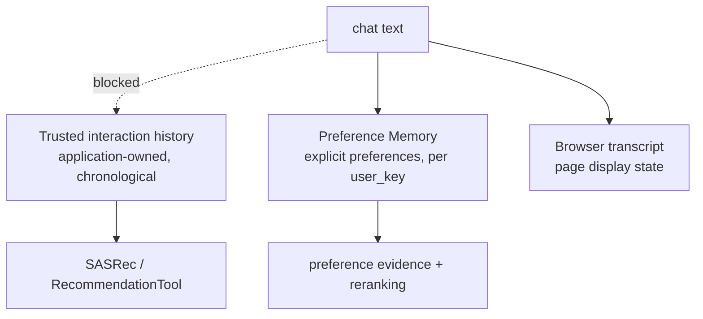

# AgentRec-X — Architecture

This document explains **what each part of the system owns and where its boundaries are**.
It is deliberately not API-reference documentation: per-package READMEs next to the code
hold the detailed contracts, and this file holds the shape.

Cross-references: [README](../README.md) · [Experiments](EXPERIMENTS.md) ·
[Usage](USAGE.md) · [Project history](PROJECT_HISTORY.md).

---

## 1. Architectural goals

1. **One trained model, everything else inspectable.** SASRec is the only learned component.
   Every other decision — retrieval, matching, ordering, routing — is deterministic and
   reviewable by reading the code.
2. **The conversational layer must not be able to corrupt behavioural data.** This is the
   primary safety property, and it is enforced structurally rather than by convention.
3. **Never fabricate.** Missing metadata stays missing; unavailable evidence stays
   `UNKNOWN`; a failed stage raises instead of degrading into plausible-looking output.
4. **No silent quality claims.** Offline policy diagnostics measure adherence to a
   configured policy, not relevance. The evaluation protocol, the benchmark and the
   diagnostics are reported as three separate categories of evidence.
5. **Compose, do not duplicate.** Each milestone added a stage behind an existing seam, and
   later stages reuse earlier contracts instead of re-implementing them.
6. **Reproducibility as a feature.** Deterministic seeds, recorded digests, frozen
   protocols, and deterministic payloads that exclude timing and machine metadata.

---

## 2. Component map

| Module | Owns | Does not own |
| --- | --- | --- |
| `recommendation/preprocess.py`, `io_utils.py` | raw review ingestion, k-core filtering, deterministic id mapping, processed artifacts | any modelling |
| `recommendation/datasets/` | SASRec training dataset, negative sampling, inference-time history encoding | scoring |
| `recommendation/models/` | SASRec architecture | training loops |
| `recommendation/training/` | deterministic trainer, checkpoint I/O, selection state | data splitting |
| `recommendation/evaluation/` | the frozen temporal leave-two-out protocol, masking, metrics | any ranking policy for serving |
| `recommendation/baselines/` | ItemCF engineering baseline | benchmark claims |
| `recommendation/inference/` | checkpoint loading, catalog scoring, deterministic top-k ranking | HTTP, agent concerns |
| `recommendation/tools/` | `RecommendationTool`: the agent-facing recommendation contract | model internals |
| `recommendation/catalog/` | `parent_asin`-keyed metadata: normalization, artifact, lookup | retrieval, ranking |
| `recommendation/rag/` | candidate-scoped evidence retrieval (`ProductEnricher`) | candidate generation |
| `recommendation/memory/` | explicit preference memory: schemas, stores, lifecycle (`PreferenceMemoryService`) | extraction from history, ranking |
| `recommendation/preference_matching/` | three-state preference↔metadata evidence (`PreferenceCandidateMatcher`) | ordering |
| `recommendation/reranking/` | the frozen ordering policy (`PreferenceReranker`) and its offline evaluation | evidence semantics |
| `recommendation/agent/` | `AgentGraph` orchestration, state, decision contract | any recommendation logic |
| `recommendation/api/` | FastAPI app, M6 endpoints, demo routes, error mapping | recommendation logic |
| `recommendation/demo/` | demo profiles, `DemoSessionManager`, `DemoRuntime`, public serialization | recommendation logic |
| `recommendation/web/` | browser assets (plain HTML/CSS/JS) | any client-side ranking |

---

## 3. Recommendation backbone

```text
raw Amazon Reviews 2023  ->  preprocessing (iterative k-core, deterministic ids)
                         ->  processed sequences + mappings artifacts
                         ->  SASRec dataset (temporal leave-two-out)
                         ->  SASRec training (validation-selected checkpoint)
                         ->  sealed test evaluation (once)
                         ->  accepted checkpoint + run manifest
```

Invariants that later layers depend on:

* interactions are **chronologically ordered**; there is no random splitting anywhere;
* item id **0 is PAD** and is never a real item; real ids start at 1;
* `parent_asin` is the **canonical** product identity and is treated as an **opaque
  string** (nothing assumes a `B` prefix);
* the accepted mappings stay authoritative for `parent_asin <-> item_id`; no later layer
  redefines identity;
* ranking is a **total order**: higher score first, then lower item id.

---

## 4. Recommendation Tool boundary

`recommendation/tools/RecommendationTool` is the *only* interface through which anything
above the model layer obtains candidates.

* `RecommendationToolRequest` carries the model-facing argument (`k`) and nothing else.
* `RecommendationContext` carries **trusted** interaction history and is passed as a
  separate argument, so history arrives from application state rather than from model or
  conversation output.
* The engine is injected once and reused; the Tool never loads a checkpoint.
* Domain errors are a stable taxonomy (`MissingUserHistory`, `UnknownHistoryItem`,
  `InvalidRecommendationRequest`, `RecommendationUnavailable`), and the Tool normalises
  engine failures instead of leaking framework internals.
* Score semantics are explicit: the value is a **raw ranking score**, not a probability,
  confidence, rating or preference score.

The Tool is a hard boundary, not a convenience wrapper: `AgentGraph` cannot reach SASRec by
any other path, so the graph cannot score, mask or rank candidates itself.

---

## 5. AgentGraph

`recommendation/agent/AgentGraph` composes the accepted stages as **optional injected
collaborators**. The graph owns orchestration only.

Node set (superset; each node exists only when its collaborator was injected):

```text
load_memory -> decide -> { direct -> finalize
                         | recommend -> enrich -> match_preferences -> rerank -> finalize }
            -> persist_memory
```

`AGENT_GRAPH_VERSION = 2` (bumped by Milestone 10D when the two preference nodes were
added).

| Injected | Route | Milestone behaviour |
| --- | --- | --- |
| `tool` | `decide -> {finalize \| recommend -> finalize}` | M7B / M7C |
| `+ product_enricher` | adds `enrich` | M8 |
| `+ memory_service` | adds `load_memory`, `persist_memory` | M9 |
| `+ preference_matcher` + `reranker` | adds `match_preferences`, `rerank` | M10D |

Construction-time validation is explicit: matcher and reranker must be supplied
**together**, a matcher requires an enricher (M10A reads the metadata M8 attached), and
each collaborator must expose its one method. A half-configured preference stage fails
loudly instead of being silently skipped. The graph never constructs a default matcher,
reranker, metadata store or memory store.

Collaborators are declared as `runtime_checkable` `Protocol`s (`ProductEnricherLike`,
`PreferenceMemoryLike`, `PreferenceMatcherLike`, `PreferenceRerankerLike`), so
`recommendation/agent` imports none of `rag`, `memory`, `preference_matching` or
`reranking`. AST guards in the test suite enforce that.

**Decision seam.** The decision model receives exactly
`build_decision_messages(user_message)` and returns an `AgentDecision` validated against a
frozen schema (`extra="forbid"`), which is why a decision cannot smuggle interaction
history. The formal tests and the demo inject a deterministic offline rule; no provider SDK
is imported anywhere.

**Presentation.** `finalize` chooses its rendering branch by *which structured stage ran*
(a `RerankingReport`, else an enrichment result, else the raw Tool result) — never by
inspecting a string. When reranking is present the response is rendered in reranked order
while keeping `original_rank` auditable.

---

## 6. Control plane (AgentRec-X 2.0-alpha, IMPLEMENTED)

The accepted `AgentGraph` (section 5) is a fixed DAG: one routing decision per run, and the
sequence after it is static. `recommendation/control/` adds a second, **opt-in** control
plane that decides the next action from an observation - a bounded agent loop. Its founding
rule is that this changes *who decides the next step* and nothing about *how a
recommendation is made*.

```text
PolicyContext --(AgentPolicy.choose)--> ActionProposal          untrusted
                                              |
                                    ActionValidator              controller-owned
                                              |
                                        ValidatedAction          stamped metadata
                                              |
                                  Trusted ActionExecutor         accepted pipeline
                                              |
                                    DomainResult                 NOT policy-visible
                                              |
                                     ResultVerifier              identity / counts / ranks
                                              |
                                      ObservationAdapter         minimised
                                              |
                                      Observation                what the policy may see
                                              |
                                       LoopController            owns the loop
```

Loop topology (`recommendation/control/topology.py`):

```text
initialize -> check_limits -> policy -> validate_action -> dispatch
                   ^                                         |-- execute -> verify
                   |                                         |             -> observe
                   |                                         |             -> update_state
                   +-----------------------------------------+----------------+
                   `-- complete -> finalize / refuse / abort -> END
```

Nodes commit their routing through LangGraph `Command(goto=...)`, because a conditional edge
is resolved from the state *before* its node runs and therefore cannot see a verdict
produced inside that node.

**Authority split.**

| Component | Owns | Must never do |
| --- | --- | --- |
| `AgentPolicy` | `choose(PolicyContext) -> ActionProposal` | execute a tool, write state, count steps, touch trusted history, supply candidate ids, commit memory, validate its own output, mark the run finished |
| `LoopController` | lifecycle, counters, `available_actions`, dispatch, budgets, termination, trajectory | score, rank, retrieve, interpret preferences, commit memory, render |
| `ActionValidator` | availability, argument re-validation, stamping `action_id` / `step_index` / `run_id` / `turn_id` | repair a proposal into a different action |
| `ResultVerifier` | Tool grounding, count and rank integrity, candidate identity, stage alignment | mutate, repair or fabricate a result |
| `CompletionGuard` | whether `FINISH` is a legal end | certify a failed or ungrounded run |

**Boundaries held as types**, not conventions: `ActionProposal != ValidatedAction`,
`PolicyContext != AgentGraphState`, `DomainResult != Observation`, and `FINISH != finished`.
A proposal has no field for history, a tool name, SQL or execution metadata; a
`PolicyContext` has no field for trusted history, a memory key, a store, an engine or
candidate ids; a `DomainResult` never reaches the policy.

**Bounded execution.** `max_steps`, `max_tool_calls` and `max_retries` are controller
configuration the policy cannot read or raise. Exhaustion terminates deterministically - the
controller does not ask the policy whether it would like to continue. LangGraph's own
`recursion_limit` is derived from the same budgets as a framework-level backstop.

**Two drivers, one engine.** `LoopController(driver="graph")` runs the compiled cycle;
`driver="direct"` runs the identical engine methods in Python, so a difference between them
is a topology bug rather than a semantics bug.

**Shared with the DAG.** `recommendation/agent/rendering.py` holds the presentation layer and
`recommendation/agent/pipeline.py` the memory-commit and finalize stages, so both control
planes render a run with one code path.

**Enabling it.** The demo runs the accepted DAG by default:

```text
AGENTRECX_CONTROL_PLANE=graph   # default: the accepted M7B-10D DAG
AGENTRECX_CONTROL_PLANE=loop    # 2.0-alpha bounded agent loop
```

---

## 7. Candidate plane (Stage 2, IMPLEMENTED)

Stage 1 allowed one candidate source. Stage 2 allows several, and this is the boundary that
keeps that safe:

```text
AgentPolicy                     chooses WHICH source - nothing else
    |
CandidatePlane                  executes that source, grounds it, records it
    |-- history        -> accepted RecommendationTool -> SASRec
    |-- catalog_search -> CatalogSearchSource over the trusted catalogue
    `-- similar_item   -> registered tool, or ABSENT
    |
GroundingVerifier               confirms every identity against trusted data
    |
CandidateLedger                 deduplicates identity, retains ALL provenance
```

**One action consults one source.** Adaptive retrieval is the point: a policy that wants two
sources proposes two actions, sees the first observation, and may change its mind. There is
deliberately no "call every source" method, because that would make fixed fan-out the easy
path and adaptive retrieval the awkward one. The fast path survives - a single
`RECOMMEND_FROM_HISTORY` action is one source and one tool call, exactly as in Stage 1.

**`CandidateLedger`** is the run's record of candidate identity and provenance.

* *Deduplicate identity, not evidence.* One entry per `parent_asin`; a later sighting
  appends a `CandidateProvenance` record rather than replacing the earlier one.
* *Never fuse heterogeneous raw scores.* `HISTORY` reports SASRec logits, `CATALOG_SEARCH`
  reports BM25, `SIMILAR_ITEM` reports similarity. Each is stored under its own `score_kind`
  and never summed or averaged. Cross-source ordering uses **reciprocal rank fusion** over
  each source's own ranking - well-defined precisely because it uses only the *order* every
  retriever can be trusted to mean.
* *Original source ranks stay recoverable*, so a candidate's full provenance can be
  reconstructed after the fact.
* Candidates may only be added by `record_from_source`, which requires a declared trusted
  source. A policy is nowhere in that call path.

**`GroundingVerifier`** answers one question: is this identity one the trusted side knows? It
checks the trusted item mapping and, when configured, the catalogue as well
(`checks_catalog` reports which). It never scores, never selects, and reads no user data. It
**fails closed**: an identity it cannot confirm is `UNGROUNDED`, retained purely as audit
evidence so a drifting source is *visible*, and never presented as a candidate.

**`CatalogSearchSource`** searches the whole catalogue lexically. It is deliberately separate
from the Milestone 8 retriever rather than a flag on it: that retriever is *candidate-scoped*
by design, which is exactly why RAG cannot widen a candidate set. Widening the scope is a
capability a policy may select, and it happens only here. The tokenizer, BM25 constants and
idf function are imported from `recommendation.rag.retrieval`, so the two retrievers cannot
drift apart in how they score text; document scope and output type are what differ. A
zero-hit search returns zero hits with `matched=False` - never an arbitrary catalogue slice.

**Unavailable sources are absent, not faked.** `SIMILAR_ITEM` is not configured by default.

### Not implemented (documented, not claimed)

* **No item-item similarity index ships.** `SIMILAR_ITEM` needs a separate build step over
  `Sports_and_Outdoors_sequences.json` (item co-occurrence) or item embeddings; neither is
  generated today. The seam is implemented and tested with a registered tool, but the source
  is unavailable unless one is explicitly registered.
* **No reranking over the fused ledger.** The accepted M10B preference reranker still runs
  over the history recommender's candidates only. Ledger-order reranking is not implemented.
* **Stages 3, 4 and 6 are not implemented.** No clarification, no task/session state, no
  memory-write proposal pipeline, no reasoning capabilities (`GET_DETAILS`, `COMPARE`,
  `TRADE_OFF`, `CHECK_COMPATIBILITY`, `BUNDLE`, `VERIFY`) and no evaluation plane. Their
  action enum members and argument contracts are declared so they can be added without
  reshaping the protocol, but no capability executes them and a proposal naming one is
  refused.

---

## 8. Interaction and personalization plane (Stage 3, IMPLEMENTED)

### Three signal domains, kept apart

The stage's central requirement is that user information is not collapsed into one profile
string. Three domains exist and are owned by different components:

| Domain | Owner | Mutability | Reaches the policy as |
| --- | --- | --- | --- |
| **A. Behavioural preference** | the host application | never written by the agent | a boolean (`has_trusted_history`) |
| **B. Long-term explicit preference** | accepted `PreferenceMemoryService` | only via a validated proposal | attributed constraint text |
| **C. Current task / session intent** | `TaskState` (this stage) | mutable during the interaction | attributed constraint text |

Domain A is application-owned and untouchable by the agent; that invariant is unchanged from
Milestone 7A.

### Task state vs persistent memory

Long-term memory deliberately takes effect **from the next turn** — the accepted Milestone 9
semantics that stops a turn from appearing to have let its own statement influence the
candidates it returned. But "not the red one *this time*" is about the current request, and
waiting a turn to honour it would be wrong. So the same sentence can produce two things:

```text
"not red this time"   -> TaskState constraint (applies now), no memory write
"never red again"     -> TaskState constraint (applies now)
                      + MemoryWriteProposal (committed for future tasks)
```

`TaskState` is mutable during the interaction, never persisted, and **immediately usable in
the turn that produced it**. A temporary override *suppresses* within the task and leaves
stored state untouched: suppression is structurally not removal, because task constraints and
memory entries are different objects.

`PreferenceScope` (`SESSION` / `TASK` / `LONG_TERM`) carries that decision, and
`PreferenceLifecycle` (`EXPLICIT` / `INFERRED_HYPOTHESIS` / `CONFIRMED` / `RETRACTED`) carries
what kind of signal it is. Only `EXPLICIT` and `CONFIRMED` may become durable preferences:
**an inference is evidence, never truth.**

### Clarification as a first-class action

`ASK_CLARIFICATION` suspends the run. It:

* runs no tool and consumes no tool-call budget;
* ends the run in `WAITING_FOR_USER` with `TerminationReason.AWAITING_USER` — neither
  `FINISHED` nor `ABORTED`, and `CompletionGuard` is never consulted;
* records a `ClarificationObservation` carrying the question, what it blocks and the offered
  options, so the trajectory can explain why the run stopped mid-way;
* is **resumable**: the next turn continues the same task by handing the suspended
  `TaskState` back, and the answer reaches the policy as a task constraint;
* is offered only while the task has not already asked, so one run cannot become an
  interrogation.

Whether clarification is *warranted* is a policy decision, not a framework rule. A policy
asks when the missing information would materially change the candidate set, ranking or
feasibility; a policy that never proposes it never enters the clarification branch.

### The memory write pipeline

```text
user text
  -> Preference Interpreter   (proposes; the accepted rule-based extractor works unchanged)
  -> MemoryWriteProposal      (value/scope/lifecycle/supporting span/turn provenance)
  -> MemoryValidator          (grounding, attribution, scope, lifecycle)
  -> PreferenceMemoryService  (the accepted, already-trusted writer) -> commit / reject
```

**A proposal is not a commit.** Nothing in `recommendation/control/memory_proposal.py` can
write the store: it holds no store handle and no `user_key`. Only a proposal the validator
marked *approved* becomes a `PreferenceCandidate` for the accepted service.

**An inference is not truth.** An `INFERRED_HYPOTHESIS` is validated as *soft evidence*
(`SOFT_ONLY`) and refused a durable commit, so an inferred long-term preference cannot
quietly become hard truth. It may still inform the current task through `TaskState`.

Validation refusals carry stable codes: `missing_value`, `removal_carries_value`,
`avoidance_expressed_as_removal`, `ungrounded_span`, `span_not_in_turn`,
`ephemeral_scope_not_persisted`, `inferred_signal_is_soft_evidence`.

The `avoidance_expressed_as_removal` check encodes the stage's explicit warning: **a negative
preference is not a memory deletion.** "I don't like red" is an `ADD` of an `AVOID`-polarity
value; only an explicit retraction is a `REMOVE`. The validator refuses to treat one as the
other.

### What the policy is shown

`PolicyContext` gained a bounded projection, not the store:

```text
task_intent                 a small vocabulary; UNKNOWN is a legitimate value
task_constraints            active, task-relevant constraint *descriptions*
hard_constraint_count       how many define feasibility
inferred_constraint_count   how many are soft evidence only
awaiting_user               whether the task is suspended
```

Relevant-memory retrieval here is **evidence selection, not mutation authority**: it selects
and bounds, and writes nothing. There is no `memory_id`, no `user_key`, no supersession chain
and no store handle in the projection, and `PolicyContext.summary()` records only counts — so
the trajectory cannot become a copy of the user's preferences.

### Not implemented (documented, not claimed)

* **No conflict-resolution algorithm across domains.** Scope and lifecycle *precedence rules*
  are represented (`hard_constraints()` vs `soft_constraints()`), but nothing yet reconciles
  a genuine contradiction between a task override and a stored preference by proposing
  `ASK_CLARIFICATION`. That belongs with Stage 4.
* **No LLM interpreter.** The accepted rule-based extractor is the only interpreter; the
  proposal seam is what a future provider adapter would implement.
* **Stages 4 and 6 are not implemented** — no reasoning capabilities and no evaluation plan.

---

## 9. Reasoning plane (Stage 4, IMPLEMENTED)

> Reasoning may change a decision; reasoning may not change a fact.

`recommendation/control/grounded_reasoning.py` reads only normalized catalogue records.
Every conclusion traces back to an attribute the catalogue actually contains, and an absent
attribute yields `UNKNOWN` rather than a plausible value. No model call is involved.

What the shipped catalogue supports (measured on 20 000 records of the real artifact):

| attribute | coverage | used for |
| --- | --- | --- |
| `Item Weight` (or `Package Weight`) | 96% | deterministic weight/portability constraints |
| `Item Package Dimensions L x W x H` | 67% | deterministic dimension facts |
| `price_text` | 77% | deterministic budget constraints |
| `Color` | 74% | matching an explicit colour constraint |
| `Brand Name` | 69% | matching an explicit brand constraint |
| `Material` | 64% | comparison only |
| categories / features | 96%+ | category constraints, comparison |

**Facts.** `GroundedFacts` exposes each attribute verbatim, plus deterministic unit conversion
for the loose human strings the artifact carries (`"1.2 Kilograms"` → 1.2 kg,
`"4.49 x 4.49 x 1.5 inches"` → centimetres). An unreadable value yields `None`; the caller
reports `UNKNOWN`. "Identity not in the catalogue" (`None`) and "in the catalogue with no
attributes" (`UNKNOWN`) are different answers and are never conflated.

**Hard constraints are three-state.** `SATISFIED` / `VIOLATED` / `UNKNOWN`, where `UNKNOWN` is
neither a pass nor a failure. A constraint whose required fact is absent must not silently pass
— that would fabricate compliance — and must not automatically fail — that would fabricate a
violation. This is what lets `CompletionGuard` refuse to certify a run whose constraints were
never actually verified. Kinds: `price_max`, `price_min`, `weight_max`, `category`, `brand`,
`color`.

**Comparison** emits a row even when every value is `UNKNOWN` (the absence of a shared fact is
a finding) and reports an unsupported attribute request rather than ignoring it.

**Trade-off** resolves a stated priority (`lighter` → weight, `cheaper` → price, `rating`) onto
a catalogue attribute, orders only the products that carry the fact, and names the rest as
unknown. It never places a product it cannot ground.

**Compatibility is grounded or `UNKNOWN`.** This catalogue carries **no interface, fitment or
model-version semantics**, so a requirement naming one of those returns `UNKNOWN` no matter how
many products are supplied — the reasoner never manufactures a "these probably fit" verdict for
a check it did not perform. Requirements it *can* ground (brand, category, colour) are answered
from catalogue attributes, and a member lacking the attribute makes the whole check unresolved.

**Bundles** emit an aggregate only when every member carries the fact; otherwise the blocking
members are named and the aggregate is `UNKNOWN`. A partial sum is never presented as a total.
A bundle is a *recommendation set under aggregate constraints*: there is no cart, order or
transaction concept anywhere in the result.

The reasoner is **read-only**. It cannot add a candidate, reorder the ledger or approve a
completion, and a test asserts it exposes no such surface.

### Not implemented (documented, not claimed)

* **No `CHECK_COMPATIBILITY` semantics for interfaces or fitment**, because the catalogue has
  none. The verdict is `UNKNOWN` by design; adding real fitment checks would require a
  different data source.
* **No semantic reasoning over requirements.** A requirement is matched against catalogue
  wording deterministically; there is no interpretation of an open-ended natural-language
  requirement.
* **The reasoning capabilities are not yet wired as loop actions.** The reasoner is a trusted,
  tested component and the `ActionKind` members (`GET_DETAILS`, `COMPARE`, `TRADE_OFF`,
  `CHECK_COMPATIBILITY`, `BUNDLE`, `VERIFY`) and their argument contracts exist, but no executor
  maps an action onto the reasoner yet, so a proposal naming one is still refused.
* **Stage 6 (evaluation plane) is not implemented.**

---

## 10. Model-driven policy (Phase 1, IMPLEMENTED)

The bounded loop already let an Observation change the next action; the policy that made that
choice was deterministic.  This phase adds a **model-driven** policy behind the same seam, and
changes nothing else.

```text
AgentState
    |
PolicyContextBuilder            bounded projection - no history, catalogue, store or executor
    |
LLMAgentPolicy                  builds a prompt, parses the answer
    |
ActionProposal                  UNTRUSTED structured proposal
    |
ActionValidator                 owns legality: availability + declared argument model
    |
ValidatedAction -> Trusted ActionExecutor
    |
DomainResult -> ResultVerifier -> ObservationAdapter
    |
Observation -> State update
    |
LLMAgentPolicy again
```

### The authority split

| The model decides | Trusted code decides |
| --- | --- |
| which action to propose, from `available_actions` | whether that action is legal (`ActionValidator`) |
| which approved candidate source to consult | how the action executes (`CandidatePlane`, capabilities) |
| whether to ask, retrieve facts, compare, or finish | which product identities exist (`CandidateLedger`, `GroundingVerifier`) |
| a short non-authoritative rationale | which catalogue facts are true (`GroundedReasoner`) |
| | whether behavioural history holds (application) |
| | whether memory may be committed (`MemoryProposalValidator`) |
| | whether a hard constraint holds (deterministic) |
| | whether `FINISH` is permitted (`CompletionGuard`) |
| | every budget and termination (`LoopController`) |

`LLMAgentPolicy.choose(context)` returns an :class:`ActionProposal` and nothing else.  It has no
access to a tool, a ledger, a store, a catalogue or an executor, so it cannot bypass one.  A
`FINISH` proposal carries no completion signal; the guard still authorises it.

### Structured output

The model is asked for one JSON object and the answer is parsed into the repository's own
`ActionProposal`.  There is no substring matching.  Three rejection classes, kept distinct
because they mean different things:

```text
not JSON              -> a formatting failure, corrected once within the same policy call
unknown / unoffered   -> a protocol violation, refused
invalid arguments     -> the action is permitted but its arguments violate its declared model
```

The per-action argument models are the contract, and `ActionProposal.model_post_init` already
enforced them before this phase; the policy adds no coercion, so a near-miss is a rejection
rather than a repair.

### What the model is shown

A short policy-contract prompt plus a bounded JSON payload: the user request, task intent and
constraints, whether trusted history exists, a **candidate count** (not the candidates), the
previous observation *summarised* (kind, status, counts) and the remaining budget.  The offered
actions and their arguments are **generated from `ARGUMENTS_BY_ACTION`**, so the prompt cannot
describe an action that does not exist or omit one that does.

Deliberately absent, and therefore unable to leak: trusted behavioural history, the memory
`user_key`, the catalogue, the candidate ledger, raw scores, product metadata, grounded
reasoning facts, and the full trajectory.  A reasoning observation contributes *that facts were
read*, never the facts - a test asserts that a product title and weight from a detail
observation do not appear in the prompt.

### Provider independence

`StructuredModelClient` is the whole seam: `complete(request) -> ModelResponse`.  A real
provider is a small adapter
(`recommendation/control/provider_adapter.py` ships the shape for any OpenAI-compatible chat
endpoint, with an **injected** transport so no HTTP library is imported and no key is stored).
Every test injects `ScriptedModelClient`, so the suite needs no network and no credential.

### Bounded failure

`max_attempts` bounds the model calls *within one policy decision*, and one decision is one
controller step.  A model that never answers usefully therefore ends the run through
`PolicyActionError` → `NO_AVAILABLE_ACTION`, not through an unbounded loop.  A provider
exception or timeout is normalised the same way.  A single malformed answer is corrected once,
with the parse error passed back as a hint.

### Documentation of the seam, not of a provider

The phase deliberately does **not** ship a live model call.  A live call requires an HTTP client
the core does not depend on, and it would make the suite non-reproducible.  The adapter contract
is implemented, tested with a stub transport, and configurable through `AGENTRECX_LLM_BASE_URL`,
`AGENTRECX_LLM_MODEL` and `AGENTRECX_LLM_API_KEY`.

### Not implemented (documented, not claimed)

* **No live provider smoke was executed.** The adapter is tested against a stub transport; no
  request has been made to a real endpoint from this repository.
* **No prompt tuning or evaluation against a real model.** The model variant is driven by a
  deterministic double, so it measures the *runtime*, not a model's competence.
* **No model-driven planning or subgoal generation** - one next action per step, as before.
* **No fine-tuning, RL or reward model.**
* **Hard-constraint narrowing was not implemented in this phase** - the model is not used to
  hide that, and the model policy cannot remove a candidate. Narrowing arrived in Phase 2
  (section 11) and is owned by trusted code, not by a policy.

---

## 11. Hard-constraint enforcement and the feasible candidate view (Phase 2, IMPLEMENTED)

`CandidateLedger != FeasibleCandidateView`
------------------------------------------
Before this phase the repository could **check** a hard constraint and could not **enforce**
one. The trusted `GroundedReasoner` already produced a per-candidate three-state verdict, but
nothing turned that verdict into task eligibility: the ledger is a provenance record with no
notion of feasibility, the candidate plane built its result from raw tool output filtered only
by grounding, and every renderer iterated whatever the candidate set held. A product the
catalogue proved violated the budget could therefore be presented as a recommendation, and the
evaluation plane could only *report* that it had been.

The two questions are now answered by two different components, and must stay apart:

| | Question | Owner |
| --- | --- | --- |
| `CandidateLedger` | did this product ever enter the candidate universe, from which source, at what rank, was its identity grounded? | `recommendation/control/candidate_ledger.py` |
| `FeasibleCandidateView` | for the constraints active **on this task, right now**, is this candidate feasible? | `recommendation/control/constraint_eligibility.py` |

```
CandidateLedger              complete audit universe - never filtered, never rewritten
      |
Constraint evaluation        GroundedReasoner.check_constraint  (deterministic, per candidate)
      |
Task eligibility             CandidateConstraintAssessment -> CandidateEligibility
      |
FeasibleCandidateView        verified_eligible / ineligible / unresolved  + full detail
      |
FeasibilityProjection        the renderer-facing artifacts, narrowed to verified feasible
      |
Ranking / finalization       accepted renderer, unchanged
```

```text
provenance is preserved; eligibility is constrained.
```

### Three-state semantics

The per-constraint verdicts are the accepted ones and are kept in full; the eligibility layer
only *derives* from them.

| Verdict | Meaning | Effect on task eligibility |
| --- | --- | --- |
| `SATISFIED` | grounded evidence proves the constraint holds | stays eligible with respect to that constraint |
| `VIOLATED` | grounded evidence proves it does not hold | candidate becomes `INELIGIBLE` |
| `UNKNOWN` | trusted evidence is insufficient | candidate becomes `UNRESOLVED` - neither pass nor fail |

```text
if ANY active hard constraint == VIOLATED:  INELIGIBLE
elif ANY == UNKNOWN:                        UNRESOLVED
else:                                       VERIFIED_ELIGIBLE
```

A proved violation **outranks** an unresolved constraint: excluding a candidate already
disproved needs no further evidence, and calling it merely unresolved would leave a known-bad
candidate inside the feasible view. `CandidateConstraintAssessment` keeps every individual
verdict, with its observed value, so "why was this product excluded" is answerable from the
trajectory rather than inferred from a boolean.

### Enforcement is not the model's

`CandidateEligibilityEvaluator` takes a `GroundedReasoner` and nothing else - no policy, no
model, no memory. It is stateless. A model policy and `RuleBasedPolicy` therefore receive
**identical** eligibility for identical grounded facts; they may take different trajectories,
but they cannot disagree about truth. A model cannot remove a candidate, and a model that
declares a violating candidate acceptable changes nothing, because the projection is built from
the deterministic verdicts.

### Task scope, and no stale verdicts

Eligibility is a statement about the current constraint set, not a permanent property of a
product: the same product is `INELIGIBLE` under `price_max=120` and `VERIFIED_ELIGIBLE` under
`price_max=200`. The evaluator holds **no cache at all** - every view is recomputed from the
current active constraints and the current grounded facts - which is the simplest design that
cannot produce stale eligibility. The cost is one fact lookup per candidate per constraint over
the run's own grounded set: never a catalogue scan.

Only `TaskState.hard_constraints()` is consulted, so the pre-existing hardness rule decides
feasibility. An explicit constraint from this turn or this session qualifies; an inferred or
memory-derived signal does not, and soft preferences keep ordering candidates **inside** the
feasible domain rather than shrinking it.

A stated constraint the catalogue carries no attribute for is mapped to
`ConstraintKind.UNVERIFIABLE` rather than dropped. Dropping it would present a candidate as
compliant with a constraint that was never tested; keeping it makes every candidate
`UNRESOLVED`, which is the honest answer.

### What the policy is shown

`PolicyContext` gains `verified_eligible_count`, `ineligible_count`, `unresolved_count`,
`feasible_parent_asins` and `active_constraints`. These are counts, constraint `kind<=value`
labels, and a **narrowing** of the allowlist the policy already had - never the catalogue facts
behind a verdict, and never an identity that was not already grounded. Excluded identities stay
out of the prompt; the policy is told *that* something was excluded and *which constraint*
excluded it.

That bounded summary is what makes `UNKNOWN` useful rather than merely honest: a policy can see
that a candidate is unresolved and spend a step reading the missing fact, which is a legal next
action it could not previously identify.

### Completion

`CompletionGuard` gained one input pair and one refusal code. It does **not** evaluate
constraints - the eligibility layer owns that - it only refuses to certify a claim of compliance
nothing supports:

* at least one candidate proved compliant -> end normally;
* nothing proved compliant but something still undecided -> `no_verified_compliant_candidate`,
  retryable, so the policy can gather the missing evidence;
* nothing proved compliant and everything disproved -> an honest "no compliant match". The
  projection presents an empty set, so nothing violating is shown, and the guard does not refuse:
  spinning until the budget expired would settle nothing that is not already settled.

### Evaluation

The plane measures **checked** and **enforced** as separate questions over separate sets:

| Metric | Set | Question |
| --- | --- | --- |
| `constraint_checked` | everything the run evaluated | was a deterministic verdict obtained? |
| `constraint_violations` | what the response was built from | did a proved violation reach the answer? |
| `constraint_unresolved_in_output` | what the response was built from | was an undecided candidate presented as compliant? |
| `constraint_not_enforced` | what the response was built from | did a violating candidate reach the answer? |

They were one question over one set, which made "checked and compliant" indistinguishable from
"never checked" and made "excluded the violation" look identical to "presented it". A case's
declared `hard_constraints` now become the run's **real** active constraints, so a case that
asserts enforcement is measured against a run that actually enforced.

### Not implemented (documented, not claimed)

* **No candidate narrowing metric.** `constraint_not_enforced` detects a violation reaching the
  answer; it does not score *how well* a set was narrowed.
* **No ordering interaction with the reranker.** The accepted reranker still orders the same
  candidate set (section 15); it is simply handed the feasible one, so it cannot resurrect an
  ineligible candidate. No fused or learned ranker is introduced here.
* **Unmappable constraints are unresolved, not resolved.** A `feature` or `material` hard
  constraint has no deterministic catalogue dimension, so it makes every candidate `UNRESOLVED`
  rather than being decided. That is deliberate and is not worked around by inventing data.
* **The evaluator is not a service.** It is a pure function over the run's own grounded
  candidates; there is no incremental or index-backed eligibility structure, because a bounded
  per-turn set does not need one.

---

## 12. Evaluation planes (Stage 6, IMPLEMENTED)

Three planes, deliberately **not** collapsed into one score.

| Plane | Question | Where |
| --- | --- | --- |
| Recommender | where does the target item land in a full-catalogue ranking? | `recommendation/evaluation/metrics.py` (unchanged) |
| Shopping quality | does the final set respect stated preferences and constraints? | `recommendation/control/grounded_reasoning.py` verdicts |
| **Agent / trajectory** | did the run choose sensible actions, respect its budgets, recover, and terminate for a defensible reason? | `recommendation/evaluation/agent/` |

The separation matters because the metrics are not interchangeable. NDCG measures ranking
position and says nothing about whether an agent asked a useful question or recovered from an
empty retrieval; a trajectory metric says nothing about recommendation accuracy. Nothing in
`recommendation/evaluation/agent/` reuses an NDCG number, and no metric here claims relevance.

### Trajectory

`AgentTrajectory` is the evaluation-facing projection of a run: per-step proposed action, whether
it was authorised, the refusal code if not, the observation kind/status, candidate and ungrounded
counts, whether the step consumed a tool call, the **policy that decided the step**, and the
terminal outcome. It is versioned and **payload-free** - no trusted history, no memory key, no
entry id - and a test asserts it.

Every step carries `policy_name`, taken from the runtime's own policy metadata. The recorded name
is identity only and never a decision input; a policy that reports no diagnostics still has its
declared `name` recorded by the loop. This exists because a variant *label* is a claim, and a
report that carried only the label could not distinguish a model-driven run from a silent fallback
to the default policy. That is not hypothetical: an ablation arm once passed
`policy_factory=None` and ran the deterministic stub while being filed as `model_policy`, which is
why the label is now corroborated by the run and asserted by a regression test.

### Cases

Twelve inspectable cases covering the ten required categories. Each declares more than a final
answer: required / acceptable / forbidden actions, expected sources, hard constraints, expected
memory effect, allowed terminal states and budgets. A run that reaches the right answer by way
of a forbidden action or an unperformed check fails.

### Metrics and attribution

`TrajectoryMetrics` reports each dimension separately and has **no ``score`` field**.
`FailureAttribution` maps every failure dimension onto the owning component
(`candidate_grounding`, `policy_selection`, `sequencing`, `completion`, `memory_scope`,
`constraint_verification`, ...), and a test asserts the mapping is total - so a new metric cannot
be added without deciding who owns it, and an unattributable failure is reported as a protocol
finding rather than dropped. `SuiteReport` reports `failures_by_component`, never one number.

Two measurements are kept separate on purpose: **checked** vs **enforced**. A run can obtain a
deterministic verdict for every candidate and still present a violating product.

### Ablation

Variants are **policy injection, not runtime flags**, so no unsafe switch enters production:
`adaptive` (the policy may react to its observation), `decide_once` (one decision, then wrap up),
and — Phase 1 — `model_policy` (a model-driven next-action policy over a deterministic
observation-reactive double). The decisive comparison is on `empty-source-recovery-required`, where
the history source returns nothing:

```text
adaptive      PASS  recommend_from_history -> search_catalog -> finish
decide_once   FAIL  recommend_from_history -> finish -> finish
model_policy  PASS  search_catalog -> finish
```

That is `Action -> Observation -> Policy` versus `Decide Once -> Fixed Workflow`, measured.

Run it with `.venv/bin/python -m experiments.agent_evaluation_smoke`.

### Not implemented (documented, not claimed)

* **No published benchmark numbers.** The cases are inspectable fixtures, not a leaderboard.
* **No clarification-quality metric.** Whether a question was *good* is not measured, only
  whether one was asked when the case required it.
* **No token or cost accounting.** Tool calls and steps are counted; token usage is not measured
  because no LLM is in the loop.
* **No candidate-narrowing *score*.** The loop now narrows a presented set (section 11), and
  the plane detects a violation reaching the answer, but it does not score how well a set was
  narrowed.
* **The model variant is driven by a double, not a model.** It measures the runtime seam and the
  authority boundary, not a model's competence (section 10).

---

## 13. Product metadata and candidate-scoped RAG

Two stages, deliberately split:

1. **`recommendation/catalog/`** turns the official Amazon Reviews 2023 product-metadata
   file into a deterministic `parent_asin`-keyed artifact and exposes a read-only lookup.
   It performs normalization and coverage accounting only — no candidate generation, no
   scoring, no ranking. A candidate with no metadata record is a normal outcome
   (`MissingMetadata`), never a reason to drop or substitute it.
2. **`recommendation/rag/`** (`ProductEnricher`) retrieves supporting evidence **inside the
   already-fixed candidate set**, using lexical BM25 over that candidate's own metadata
   fields.

The boundary is the point:

| RAG may | RAG may not |
| --- | --- |
| select metadata evidence fragments for a candidate | introduce a new candidate |
| attribute each fragment to a source field and provenance | replace SASRec candidate generation |
| support preference matching and grounded explanations | reorder candidates by itself |

Every fragment is verbatim, attributed and provenance-labelled. Missing metadata is
reported as unavailable rather than filled with generated text. Any reordering is a
*separate later stage* (section 16) with its own frozen policy.

---

## 14. Preference memory

`recommendation/memory/PreferenceMemoryService` owns explicit conversational preferences.
It is a different domain from interaction history and shares no field, method or table with
it — this package has no representation for a `parent_asin` history at all, so chat text
cannot become a behavioural event even in principle.

* **Scope.** Every record is keyed by an explicit `user_key`. There is no process-global
  store. The demo derives one `user_key` per session.
* **Provenance.** Each entry keeps its source turn id and the exact user span that produced
  it, so no preference can exist without evidence of what the user actually said.
* **Lifecycle is explicit.** `ADD` creates an independent constraint; an explicitly
  corrective statement (`instead`, `instead of X`, `make that`, `I meant`) produces
  `REPLACE` and supersedes same-kind, same-polarity entries; an explicit retraction
  produces `REMOVE` tombstones. Replacement is *never* inferred from the preference kind, so
  "I don't want red" followed by "I don't want blue" keeps both. Superseded and removed
  entries are retained for audit and excluded from use.
* **Extraction is injected** and called only with user-authored text — never with history,
  candidates, metadata, retrieval evidence or model output.
* **Persistence.** An in-memory store for tests and a versioned SQLite store
  (`SQLitePreferenceStore`) for runtime, using only the standard library.
* **No ranking.** Memory does not reorder candidates. It feeds evidence (section 8), which
  feeds ordering (section 9).

---

## 15. Preference evidence

`recommendation/preference_matching/PreferenceCandidateMatcher` evaluates each **ACTIVE**
preference against each candidate's **already-attached** metadata and returns one record per
pair with a three-state status:

* `MATCH` — the metadata positively satisfies the preference;
* `VIOLATION` — the metadata explicitly breaks it (a forbidden value is present, or a
  numeric bound is crossed);
* `UNKNOWN` — the available metadata cannot decide.

`UNKNOWN` is deliberately not a boolean false. A positive preference whose listed value
differs (`prefer red` against `Color = blue`) is `UNKNOWN`, because a metadata record is not
an exhaustive product specification. Positive preferences therefore never produce a
violation; only negative categorical constraints and numeric bounds can. This conservative
asymmetry is a correctness choice with a visible cost: evidence coverage under-reports the
metadata that is actually present.

Support is declared per preference kind against the real metadata schema, so a kind no field
can express is `UNKNOWN` for a *reason* (`unsupported_preference_kind`) rather than looking
like missing data.

The matcher reads only what the enricher attached; it holds no catalogue handle, retriever
or store, so it cannot reach a product outside the candidate universe, and it never adds,
drops or reorders anything.

---

## 16. Deterministic reranking

`recommendation/reranking/PreferenceReranker` applies one frozen lexicographic key:

```text
(violation_count ASC, match_count DESC, original_rank ASC, item_id ASC)
```

1. fewer supported violations wins;
2. at equal violations, more supported matches wins;
3. remaining ties keep the original SASRec order (minimal movement);
4. `item_id` is a defensive final key guaranteeing a total order.

Why lexicographic rather than a weighted score: raw SASRec scores are uncalibrated and
preference evidence has no validated numeric scale, so the policy prioritises explicit
constraint adherence **without** numerically combining uncalibrated signals.

Invariants (asserted by tests and re-checked offline by M10C):

* the same candidates come out that went in — never added, removed, replaced or filtered,
  even when a candidate violates a preference;
* the raw SASRec score is copied exactly — no normalisation, penalty or combination;
* the input evidence report is not mutated;
* reranked ranks are contiguous `1..N`;
* the reranker reads only the evidence report — no store, retriever, model, Tool or network.

`reranking/evaluation.py` (M10C) is the **offline** diagnostic layer: displacement, top-k
overlap, adherence-at-k, coverage, policy consistency, violation protection and movement
attribution. It calls the production reranker exactly as serving does, so it cannot drift
from it. It is **not** part of the serving path — no runtime node imports it, and AST guards
enforce that.

An accepted M10C finding worth recording: with valid input (**unique original ranks**),
`item_id` is never reached, so it does not determine production ordering. A separate,
purely cosmetic issue is that the M10B tail `reason` label can be imprecise for the last
candidate; ordering is unaffected, and the label is deliberately not surfaced to users.

---

## 17. Web / session layer

Three layers, each with a narrow job:

| Layer | Module | Owns |
| --- | --- | --- |
| HTTP adapter | `recommendation/api/demo_routes.py` | request validation, session lookup, turn-id allocation, graph invocation, serialization, HTTP error mapping |
| Session state | `recommendation/demo/sessions.py` | session registry, per-session locks, turn sequencing, capacity, reset |
| Composition | `recommendation/demo/runtime.py` | building heavy collaborators once, per-`(k, user_key)` compiled-graph cache |

The controller contains **no** scoring, masking, sorting, retrieval, matching, reranking or
explanation logic, and imports none of those implementations (AST-guarded). It cannot: the
graph does not expose candidate scoring, and the graph is reached only as a whole.

**Session model.** A session owns an opaque UUID4 `session_id`, a **session-derived**
preference-memory `user_key` (never derived from the demo profile, so two sessions on one
profile stay isolated), the application-owned trusted history copied from a `DemoProfile`,
a logical creation index, a turn counter and its own `threading.Lock`. Session ids are
capability tokens for a local demo, not an identity system.

**Turn ownership.** Turn ids are `"<session_id>:<sequence>"`, allocated by the server while
holding that session's lock, and never accepted from a client. A failed turn still consumes
its id, so retries cannot reuse one. There is no global lock: different sessions proceed
independently.

**Public serialization.** `recommendation/demo/serialization.py` is an explicit **whitelist**
adapter from graph state to the public response — no `dict(state)`, no `model_dump()` of
internal models, no splat. Candidate metadata and evidence are attached by
`(parent_asin, item_id)` **identity**, never by list position, so a reordered candidate can
never inherit its neighbour's facts.

**Frontend.** Plain HTML/CSS/JS served as static files: no Node toolchain, no framework, no
CDN. All dynamic text is written with `textContent` / `createElement` (`innerHTML` and
friends appear nowhere), and the client contains no scoring, sorting, filtering or
re-ranking — it renders the API's sequence and the API's rank fields.

---

## 18. State ownership

| State | Owner | Lifetime | Writable by |
| --- | --- | --- | --- |
| Trusted interaction history | application / session | process (rebuilt from accepted artifacts) | application only |
| Preference memory | `PreferenceMemoryService` + store | persistent (SQLite) | the user's own explicit statements |
| Browser transcript | the page | the page | the page |
| Tool result, enrichment, evidence, reranking | graph run (derived) | one run | the stage that produced it |
| Live session registry | `DemoSessionManager` | process only | the session layer |
| Accepted artifacts | repository | durable | explicit retraining, to a new run directory |

Two rules follow. First, **original order is never overwritten**: `tool_result` and
`enrichment` keep SASRec order and their `rank` values are the authoritative
`original_rank`; the reranking report is additive derived state. Second, **one coherent
memory snapshot per turn**: the snapshot is read once at turn start and used for the whole
turn, so a write during the turn cannot influence it.

---

## 19. Trust boundaries


```mermaid
flowchart TD
    CHAT["chat text"]
    H["Trusted interaction history<br/>application-owned, chronological"]
    P["Preference Memory<br/>explicit preferences, per user_key"]
    T["Browser transcript<br/>page display state"]
    S["SASRec / RecommendationTool"]
    R["preference evidence + reranking"]

    CHAT -. "blocked" .-> H
    CHAT --> P
    CHAT --> T
    H --> S
    P --> R
```

1. **Chat text → interaction history is blocked.** Structurally: the decision step is
   `build_decision_messages(user_message)`, a function of one string with no parameter that
   could carry history; `AgentDecision` forbids unknown fields; the history channel has no
   reducer and no node writes it; the Tool reads history from `RecommendationContext` built
   from application state. Telling the demo *"I bought B0BX5QFWQN."* creates no interaction
   event, and this is asserted at the HTTP level.
2. **Chat text → preference memory is bounded.** Only explicit preference statements can
   create entries, and every entry carries the source span and turn that produced it.
3. **Preference memory → interaction history does not exist.** The memory package has no
   representation for a `parent_asin` history; the two domains share no type.
4. **Retrieval cannot widen the candidate set.** RAG operates only inside the candidates
   SASRec produced.
5. **Ordering cannot invent candidates.** The reranker emits a permutation of its input;
   the renderer re-verifies that by identity and raises if the candidate set changed.
6. **The browser is untrusted.** Request schemas are `extra="forbid"` and contain no field
   for history, `parent_asin`s, a preference snapshot, a reranking report, a `user_key`, a
   session id or a turn id.

---

## 20. Failure behaviour

The system prefers explicit failure to plausible degradation.

| Stage | On failure |
| --- | --- |
| Tool / engine | raises a Tool domain error; enrichment, matching and reranking are never reached |
| Enrichment | propagates; no preference evidence is fabricated |
| Matcher | propagates; no partially reranked list is produced |
| Reranker | propagates; the graph never falls back to a raw-order answer presented as if the policy ran |
| Renderer | raises `AgentGraphError` if the reranking report changed the candidate count or introduced an unknown identity |
| Session layer | unknown/expired/reset session → explicit 404; capacity → explicit 503; the server never silently creates a session |
| HTTP mapping | every `5xx` detail is authored by the mapping layer, so exception text, paths and stack traces never reach a client |

`DIRECT` is unaffected by any failure in the preference stages, because it never reaches
them. Candidate exhaustion is a **normal** outcome (`returned_k == 0`) and is rendered as a
neutral empty state — never padded with a fallback product. There is no popularity or random
fallback anywhere.

---

## 21. Determinism and reproducibility

* **Seeds and protocol are recorded.** The accepted run manifest pins seed 2026, the model
  and optimizer configuration, the evaluation protocol version, the cohort definition, the
  processed-artifact digests and the raw-data digest.
* **Checkpoint selection is validation-only.** The manifest asserts
  `test_sealed.test_used_for_selection = false`; the test set is opened once, after
  selection.
* **Ranking is deterministic.** The tie rule is a total order, so results do not depend on
  sort stability or platform.
* **Reranking is deterministic** and its reasons are derived from the canonical key rather
  than from labels.
* **Offline reports exclude timing and machine metadata** from their deterministic payload,
  so repeated runs share a digest. The accepted M10C real-cohort digest is
  `c8fe88efbdc96188…`, reproduced byte-identically by later milestones.
* **The graph is a pure function of its inputs** for a fixed `(k, user_key)`: the same
  script over fresh sessions produces identical order, ranks, evidence counts and text
  (session ids, turn ids and timings excluded).

---

## 22. Dependency lifecycle / heavy-object reuse

Constructed **once per process** by `DemoRuntime`:

| Object | Cost | Note |
| --- | --- | --- |
| `SASRecInferenceEngine` | ~349 MB checkpoint | verified against the accepted digest at startup |
| `RecommendationTool` | thin | wraps that one engine |
| `MetadataIndex` | ~300 MB artifact | parsed once, not per candidate or per turn |
| `ProductEnricher` | thin | wraps that one index |
| `PreferenceMemoryService` + store | one SQLite database | session-scoped namespaces inside it |
| `PreferenceCandidateMatcher` | stateless | one instance |
| `PreferenceReranker` | stateless | one instance |
| `DemoSessionManager` | bounded registry | `max_sessions`, optional TTL |

**The one genuinely per-request value is `k`**, because the accepted trust boundary routes
it exclusively through `AgentDecision` and there is no other channel. The runtime therefore
caches one compiled `AgentGraph` per `(k, session user_key)`: compiling a graph is pure
Python over the *same* process-scoped collaborators, the cache is bounded, and entries are
released when a session is reset. No model, index or service is ever rebuilt per request or
per turn.

The graph is bound to a memory namespace at construction (accepted M9 contract), which is
why the cache key includes `user_key` rather than one shared graph being mutated. This is a
deliberate choice to keep the frozen Milestone 7–10 components unchanged.

Startup fails fast when a required accepted artifact is missing, so a misconfigured server
refuses to start rather than failing on the first browser request. When an engine is
injected (tests), the demo reuses it instead of loading a second checkpoint.

---

## 23. Known limitations

* **Preference extraction is conservative and rule-based**, behind an injected seam.
* **Evidence coverage can be sparse** by design: a readable field holding a different value
  is `UNKNOWN`, so coverage under-reports available metadata.
* **No preference-conditioned relevance labels and no user study** — policy adherence is
  measured, recommendation-quality improvement is not claimed.
* **No production authentication**; session ids are demo capability tokens.
* **The live session registry is process-local** and does not survive a restart; preference
  memory does.
* **Reset retains preference rows as unreachable audit provenance** — accepted memory
  semantics retain history and the web layer is forbidden from erasing store rows.
* **No learned Critic**; reranking is a frozen lexicographic policy.
* **Candidate generation is item-ID SASRec**; no Semantic IDs or generative recommender.
* **Candidate-scoped RAG is lexical BM25**, not dense retrieval.
* **The M10B tail reason label can be imprecise** for the last candidate; ordering is
  unaffected and the label is not user-facing.
* **ItemCF is not comparable** to the accepted full-data SASRec benchmark.
* **Hard-constraint enforcement is catalogue-bound.** A stated constraint with no
  deterministic catalogue dimension (`feature`, `material`, a free-form constraint) makes every
  candidate `unresolved`; it is never silently satisfied and never fabricated, so such a run
  presents nothing rather than guessing. Enriching the catalogue is the fix, not weakening the
  semantics.
* **Eligibility is recomputed per turn, not indexed.** It is a pure function over the run's own
  grounded candidates, which is correct and cheap at this scale but is not an incremental
  constraint index.
* **No real provider has been called.** The model policy is exercised through a deterministic
  double (section 10); no claim is made about a real model's constraint behaviour.
