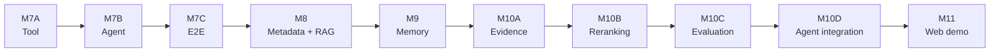

# AgentRec-X — Project History

How the repository reached its current state, milestone by milestone, with the commit that
introduced each one.

Cross-references: [README](../README.md) · [Architecture](ARCHITECTURE.md) ·
[Experiments](EXPERIMENTS.md) · [Usage](USAGE.md).

---

## Milestone evolution



Earlier: `M0 → M1 → M1.5 → M2A → M2B → M3 → M4 → M5 → M6` built the recommendation
backbone that everything above consumes.

---

## Commit map

| Milestone | Scope | Commit |
| --- | --- | --- |
| M0 | Development environment (AutoDL, RTX 4090, PyTorch/CUDA verification) | `859fd0b` (scaffolding only) |
| M1 | Amazon Reviews 2023 preprocessing pipeline | `5244298` |
| M1.5 | Real-data integration verification | `5244298` |
| M2A | Unified evaluation protocol | `5244298` |
| M2B | ItemCF engineering baseline | `5244298` |
| M3 | SASRec dataset + model | `5244298` |
| M4 | Tiny dataset / forward pass / overfit / smoke | `5244298` |
| M5 | Full SASRec training + formal benchmark | `5244298` |
| M6 | SASRec inference + FastAPI service | `812ff31` |
| M7A | Recommendation Tool contract | `cb1e385` |
| M7B | Minimal LangGraph agent | `8fca6fd` |
| M7C | Real Agent ↔ Tool end-to-end | `0fe3f58` |
| M8 | Product metadata + candidate-scoped RAG | `1715978` |
| M9 | Preference Memory | `c03582b` |
| M10A | Preference Evidence | `cce4289` |
| M10B | Deterministic reranking | `d020d09` |
| M10C | Reranking policy evaluation | `559ab10` |
| M10D | AgentGraph reranking integration | `645b50a` |
| M11 | Multi-turn web demo | `c7c3bf5` |

Full hashes:

```text
c7c3bf5b2d764e3a8ca177de41e7d9080c3f5c0f  milestone11: add multi-turn web demo
645b50adf380ca05001af0a496ec69171ac72a71  milestone10d: integrate preference reranking into agent
559ab105d1e154b0a4ace6439292f69dd5201f7e  milestone10c: add reranking policy evaluation
d020d093ccd7dc354291eafad3f6e84dc8943514  milestone10b: add deterministic preference reranking
cce4289a75a4e78b95a23883a05cc8aec81bf69f  milestone10a: add preference candidate evidence
c03582b4f2d4cb11558d97123e07500796a32feb  milestone9: add preference memory
1715978e8aa2820175ea425717a3f32c58f96379  milestone8: add product metadata and candidate rag
0fe3f58b8a0ab5acb99909d5f3d1cc96edc002dd  milestone7c: add agent recommendation e2e
8fca6fd6fa8837e777c0043614ffd4840f9cea68  milestone7b: add minimal langgraph agent
cb1e3851c86db1fe82375a4822fc5a8b89c26935  milestone7a: add recommendation tool contract
812ff3107fbba78caafef539fb0dd6b47661cf42  milestone6: add SASRec inference and FastAPI service
5244298137f8b70e516b4846d905ab559834cdfe  milestone5: complete full SASRec training baseline
859fd0bbbfe8a000f496a3ed4b67a6e229df56c9  chore: initialize AgentRec-X repository
```

---

## Reading the commit map correctly

Two details matter, and neither should be inferred from the milestone numbering alone.

**1. `859fd0b` contains no application code.** The initial commit holds exactly three
files: `.gitignore`, `AGENTS.md` and an empty `README.md`. It is a repository scaffold, not
a runnable system.

**2. M0–M5 share one commit.** `5244298` ("milestone5: complete full SASRec training
baseline") introduces 54 files and is where the preprocessing pipeline, the unified
evaluation protocol, the ItemCF engineering baseline, the SASRec dataset/model/trainer, the
tiny-overfit gate, the canonical training script, the formal test script and their test
suites all first appear. Those milestones were developed before the repository had a commit
checkpoint and were committed together.

Consequently:

* the accepted benchmark's manifest records `git.commit = 859fd0b…` with
  `git.dirty = true` — the training run was executed from a **dirty working tree** on top of
  the scaffold commit, and the code it ran was committed afterwards as `5244298`. The
  benchmark is tied to the artifact digests recorded in its own manifest, not to a clean
  commit of the training code;
* M0 is an environment/verification milestone with no code artifact, so it has no commit of
  its own;
* only M6 onward have one commit per milestone.

`runs/` and `data/` are git-ignored, so no checkpoint, manifest or dataset appears in any
commit.

---

## What each milestone added

| Milestone | Added | Boundary it established |
| --- | --- | --- |
| M1 | `recommendation/preprocess.py`, `io_utils.py`, `config.py` | chronological ordering; iterative k-core; deterministic ids; item id 0 reserved for PAD |
| M1.5 | real-data integration verification | the 100k prefix is engineering-only, never a benchmark |
| M2A | `recommendation/evaluation/` | frozen temporal leave-two-out; full-catalogue ranking; masking; deterministic tie rule |
| M2B | `recommendation/baselines/` | ItemCF as an engineering baseline, explicitly not a comparable benchmark |
| M3 | `recommendation/datasets/`, `models/` | SASRec dataset, deterministic negative sampling, encoder reused at inference |
| M4 | tiny-overfit gate | expensive training must not be the first validation step |
| M5 | `recommendation/training/`, canonical + formal test scripts | validation-only selection; sealed test set; recorded run manifest |
| M6 | `recommendation/inference/`, `api/` | thin HTTP adapter; model loaded once; raw score is not a probability |
| M7A | `recommendation/tools/` | `RecommendationTool` is the only route to candidates; trusted history arrives via `RecommendationContext` |
| M7B | `recommendation/agent/` | injected decision seam; chat text has no path into interaction history |
| M7C | real-chain E2E + smoke | the real checkpoint/engine/database chain, not just fakes |
| M8 | `catalog/`, `rag/` | metadata is descriptive only; retrieval is confined to the SASRec candidate set |
| M9 | `memory/` | explicit preferences as a separate, user-scoped domain from behavioural history |
| M10A | `preference_matching/` | three-state evidence; `UNKNOWN` is not a failure |
| M10B | `reranking/` | one frozen lexicographic policy; no filtering, no score mutation |
| M10C | `reranking/evaluation.py` | offline diagnostics only; no relevance claim; `item_id` unreachable for valid input |
| M10D | agent integration | evidence + policy wired into the route as optional injected collaborators |
| M11 | `demo/`, `api/demo_routes.py`, `web/` | session isolation, server-owned turn ids, explicit serialization boundary |

---

## Cross-milestone invariants

These held from the milestone that introduced them through the current state — later
milestones extended the system without relaxing any of them.

| Invariant | Introduced | Still true |
| --- | --- | --- |
| Item id 0 is PAD; real ids start at 1 | M1 | yes |
| `parent_asin` is canonical and opaque | M1 | yes |
| No random train/test splitting | M2A | yes |
| Full-catalogue ranking with masked seen items | M2A | yes |
| Deterministic total-order tie rule | M2A | yes |
| Chat text cannot write interaction history | M7B | yes, asserted at the HTTP level in M11 |
| The Tool is the only route to candidates | M7A | yes |
| Retrieval cannot widen the candidate set | M8 | yes |
| Superseded/removed preferences never rank | M9 | yes |
| `UNKNOWN` is neutral, never a penalty | M10A | yes |
| Reranking never adds, drops, filters or rescales | M10B | yes |
| No relevance claim from policy adherence | M10C | yes |
| M10C stays out of the serving path | M10C | yes |
| One memory snapshot per turn | M9 | yes |
| Heavy objects constructed once per process | M6 | yes, extended in M11 |

---

## Documentation status

Per-package READMEs were written as each package landed and are the authoritative internal
contracts:

```text
recommendation/{api,agent,baselines,catalog,datasets,demo,evaluation,inference,
                memory,models,preference_matching,rag,reranking,tools,training}/README.md
```

The project-level `README.md` and the `docs/` set (architecture, experiments, usage, this
history) were added as a documentation-and-presentation pass after M11. They describe
existing behaviour; they did not change production code.
